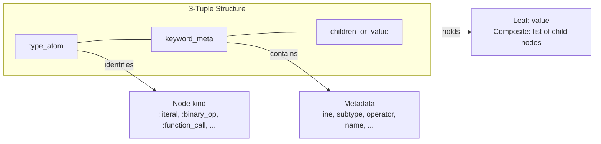
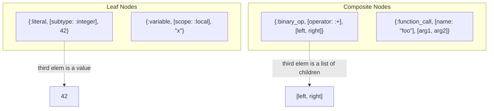
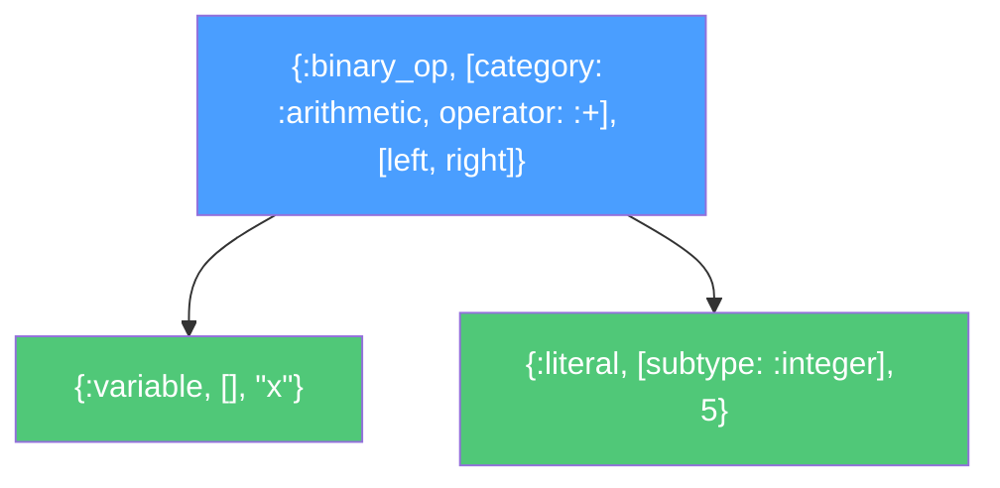
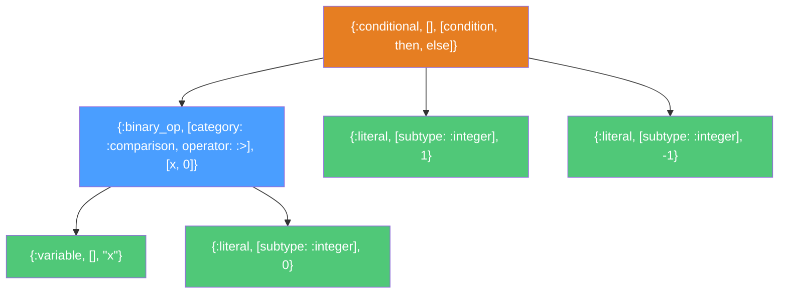
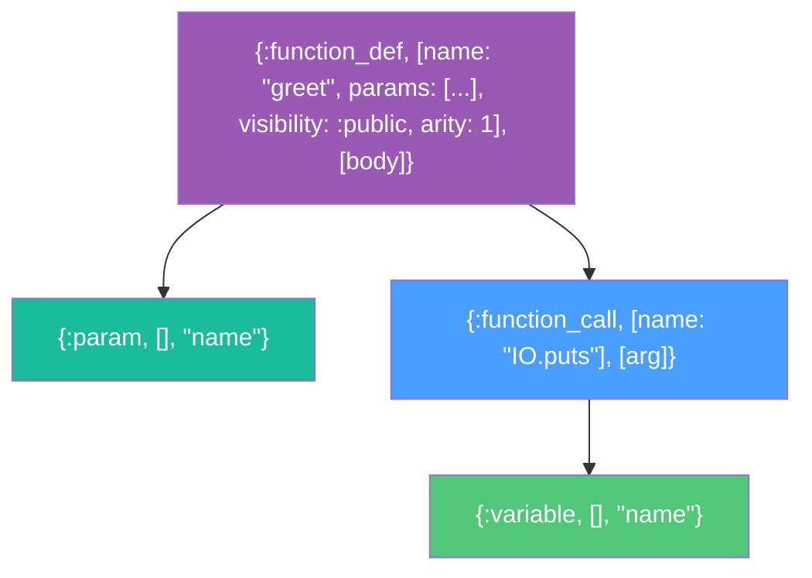
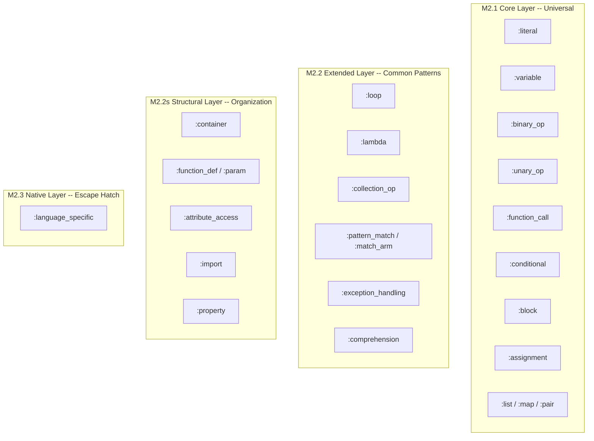
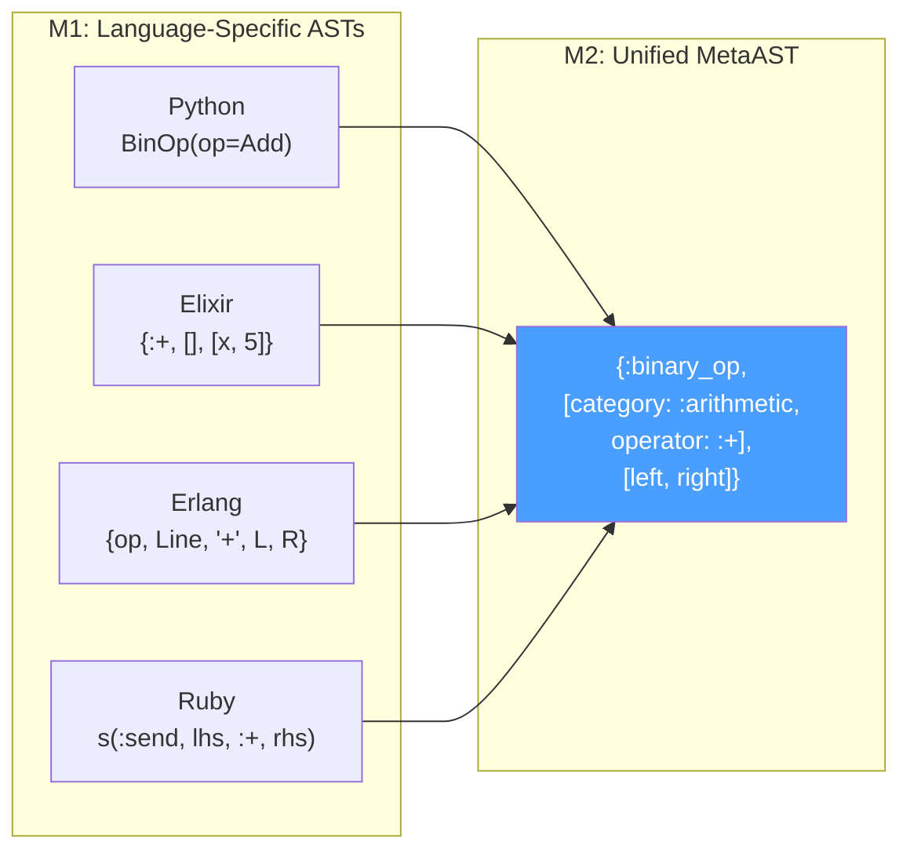

# Getting Started with Metastatic Development

Welcome to Metastatic! This guide will help you get up and running with the development environment.

## Prerequisites

### Required
- **Elixir 1.19+** and **Erlang/OTP 27+**
- **Git** for version control

### Current Status
Metastatic is production-ready.

- **Language adapters:** Python, Elixir, Erlang, Ruby, Haskell
- **Semantic enrichment:** OpKind metadata (DB, HTTP, file, cache, auth, queue, external API)
- **Mix tasks:** inspect, translate, validate_equivalence, gen.supplemental, supplemental_check

**Current Capabilities:**
- Parse and transform code across Python, Elixir, Erlang, Ruby, and Haskell
- Cross-language translation and semantic equivalence validation
- Semantic operation detection via OpKind
- Supplemental modules for library-specific constructs

For static analysis, see [MetaCredo](https://github.com/Oeditus/metacredo).

### Optional (for extended language support)
- **Python 3.9+** for Python adapter
- **Node.js 16+** for JavaScript adapter (future)
- **Go 1.19+** for Go adapter (future)
- **Rust 1.65+** for Rust adapter (future)
- **Ruby 3.0+** for Ruby adapter

## Quick Setup

```bash
# Clone the repository
cd /home/am/Proyectos/Oeditus/metastatic

# Install dependencies
mix deps.get

# Run all tests
mix test

# Generate documentation
mix docs

# Run static analysis (optional)
mix format --check-formatted
```

## Project Structure

```
metastatic/
├── lib/
│   └── metastatic/
│       ├── ast.ex                  # Core MetaAST type definitions (3-tuple format)
│       ├── document.ex             # Document wrapper with metadata
│       ├── builder.ex              # High-level API
│       ├── adapter.ex              # Adapter behaviour
│       ├── validator.ex            # Conformance validation
│       ├── adapters/               # 5 language adapters
│       │   ├── python/             # Full Python support
│       │   ├── elixir/             # Full Elixir support
│       │   ├── erlang/             # Full Erlang support
│       │   ├── ruby/               # Full Ruby support
│       │   └── haskell/            # Full Haskell support
│       ├── supplemental/           # Cross-language construct support
│       │   ├── registry.ex         # Supplemental module registry
│       │   ├── transformer.ex      # Transformation helper
│       │   └── python/             # Pykka (actors), Asyncio
│       ├── semantic/               # Semantic metadata systems
│       │   ├── op_kind.ex          # Operation kind metadata (DB, HTTP, file, etc.)
│       │   └── enricher.ex         # Semantic enrichment for AST nodes
│       └── mix/tasks/              # CLI tools (5 tasks)
│           ├── metastatic.translate.ex
│           ├── metastatic.inspect.ex
│           ├── metastatic.validate_equivalence.ex
│           ├── metastatic.gen.supplemental.ex
│           └── metastatic.supplemental_check.ex
├── test/
│   └── metastatic/                 # 1764 tests (1523 + 241 doctests)
│       ├── ast_test.exs
│       ├── adapters/               # Python, Elixir, Erlang, Ruby, Haskell
│       ├── supplemental/           # Supplemental modules
│       └── mix/tasks/              # CLI tools
├── RESEARCH.md                     # Research and architecture
├── THEORETICAL_FOUNDATIONS.md      # Formal theory
├── IMPLEMENTATION_PLAN.md          # Detailed roadmap
├── GETTING_STARTED.md              # Developer guide (this file)
└── README.md                       # Project overview
```

## Development Workflow

### 1. Understanding the Architecture

Before diving in, read these documents in order:

1. **README.md** - High-level overview and current status
2. **RESEARCH.md** - Deep dive into the MetaAST design decisions
3. **THEORETICAL_FOUNDATIONS.md** - Formal meta-modeling theory with proofs
4. **IMPLEMENTATION_PLAN.md** - Roadmap and milestones

### 2. Running Tests

```bash
# Run all tests (1764 tests: 1523 tests + 241 doctests)
mix test

# Run specific test file
mix test test/metastatic/ast_test.exs

# Run with verbose output
mix test --trace

# Generate documentation
mix docs

# Open documentation in browser
open doc/index.html
```

### 3. Working on a Feature

Follow this process:

```bash
# 1. Create a feature branch
git checkout -b feature/my-feature

# 2. Make your changes
# Edit files in lib/ and test/

# 3. Run tests frequently
mix test

# 4. Format code
mix format

# 5. Run static analysis
mix credo

# 6. Commit with descriptive messages
git commit -m "Add support for X in MetaAST"

# 7. Push and create PR
git push origin feature/my-feature
```

### 4. Code Style

We follow standard Elixir conventions:

- **Formatting**: Use `mix format` (configured in `.formatter.exs`)
- **Documentation**: All public functions must have `@doc` and examples
- **Typespecs**: All public functions must have `@spec`
- **Tests**: Aim for >90% coverage
- **Naming**: Use descriptive names, avoid abbreviations

**Example:**

```elixir
@doc """
Transform a Python binary operation to MetaAST.

## Examples

    iex> transform_binop(%{"_type" => "Add"})
    {:binary_op, :arithmetic, :+, left, right}

"""
@spec transform_binop(map()) :: {:ok, MetaAST.node()} | {:error, term()}
def transform_binop(%{"_type" => op_type, "left" => left, "right" => right}) do
  # Implementation
end
```

## Common Tasks

### Working with MetaAST

MetaAST uses a uniform 3-tuple format: `{type_atom, keyword_meta, children_or_value}`

#### Reading a MetaAST Node

Every MetaAST node follows the same 3-element tuple structure.
Here is how to read one:



Leaf vs. composite nodes differ only in the third element:



#### Common Node Type Examples

A simple expression `x + 5` maps to MetaAST as follows:



A conditional `if x > 0 then 1 else -1`:



A function definition `def greet(name)` with structural nodes:



#### MetaAST Layer Mapping

Every node type belongs to exactly one layer in the meta-model:



```elixir
alias Metastatic.{AST, Document, Validator}

# Create a MetaAST manually (3-tuple format)
ast = {:binary_op, [category: :arithmetic, operator: :+], [
  {:variable, [], "x"},
  {:literal, [subtype: :integer], 5}
]}

# Check conformance
AST.conforms?(ast)  # => true

# Extract variables
AST.variables(ast)  # => MapSet.new(["x"])

# Wrap in a document
doc = Document.new(ast, :python)

# Validate with metadata
{:ok, meta} = Validator.validate(doc)
meta.level  # => :core
meta.depth  # => 2
meta.variables  # => MapSet.new(["x"])
```

### AST Traversal & Manipulation

MetaAST trees need to be walked, searched, and transformed. Whether you are
building a linter, a refactoring tool, or a complexity analyser, the traversal
API is the main workhorse. Metastatic mirrors every useful function from Elixir's
`Macro` module so that working with MetaAST feels familiar.

All functions live in `Metastatic.AST` and are re-exported as convenience wrappers
on the top-level `Metastatic` module.

#### Depth-first walks

The simplest traversals transform every node without carrying state:

```elixir
alias Metastatic.AST

# postwalk/2 -- visit children first, then the parent (bottom-up)
new_ast = AST.postwalk(ast, fn
  {:literal, meta, n} when is_integer(n) -> {:literal, meta, n * 2}
  other -> other
end)

# prewalk/2 -- visit the parent first, then children (top-down)
new_ast = AST.prewalk(ast, fn
  {:variable, meta, name} -> {:variable, meta, String.downcase(name)}
  other -> other
end)
```

When you need to accumulate results (collect names, count nodes, etc.),
use the 3-arity variants:

```elixir
# Collect all variable names encountered during traversal
{_ast, vars} = AST.prewalk(ast, [], fn
  {:variable, _, name} = node, acc -> {node, [name | acc]}
  node, acc -> {node, acc}
end)
```

For full control, `traverse/4` lets you supply both a *pre* and a *post* function
(mirrors `Macro.traverse/4`):

```elixir
{new_ast, acc} = AST.traverse(ast, initial_acc,
  fn node, acc -> {node, acc} end,   # pre  -- called before children
  fn node, acc -> {node, acc} end    # post -- called after children
)
```

#### Lazy enumerable walkers

When you only need to *read* the tree (no transformation), the walker streams
avoid building a transformed copy:

```elixir
# prewalker/1 -- lazy Stream, depth-first pre-order
all_types = ast |> AST.prewalker() |> Enum.map(&AST.type/1)
# => [:binary_op, :variable, :literal]

# postwalker/1 -- lazy enumerable, depth-first post-order
ast |> AST.postwalker() |> Enum.count(&AST.leaf?/1)
```

#### Finding a node and its ancestors

`path/2` returns the route from a matching node up to the root, which is
invaluable for contextual analysis ("is this literal inside a function call
that is inside a loop?"):

```elixir
path = AST.path(ast, fn {:literal, _, 42} -> true; _ -> false end)
# => [{:literal, [subtype: :integer], 42}, {:binary_op, ...}, ...root]
#    first element is the match, last is the AST root
```

Returns `nil` when no node matches.

#### Pipe chain utilities

Elixir pipe expressions are represented as nested `:pipe` nodes.
`unpipe/1` flattens them:

```elixir
steps = AST.unpipe(pipe_ast)
# => [{initial_value, 0}, {function_call_1, 0}, {function_call_2, 0}]
```

`pipe_into/3` is the inverse -- it injects an expression into a function call's
argument list at the given position:

```elixir
call = {:function_call, [name: "String.trim"], []}
AST.pipe_into({:variable, [], "input"}, call, 0)
# => {:function_call, [name: "String.trim"], [{:variable, [], "input"}]}
```

#### Call decomposition

Extract the name and arguments from a function call node:

```elixir
AST.decompose_call({:function_call, [name: "Repo.get"], [arg1, arg2]})
# => {"Repo.get", [arg1, arg2]}

AST.decompose_call({:literal, [subtype: :integer], 42})
# => :error
```

#### Human-readable representation

`to_string/1` prints a compact, pseudo-code representation useful for
debugging and logging:

```elixir
AST.to_string(ast)
# => "x + 5"   (for a binary_op node)
# => "foo(x, 1)" (for a function_call)
# => "[1, 2]"    (for a list of literals)
```

#### Predicates

```elixir
# Is the node (and all descendants) purely literal?
AST.literal?({:list, [], [{:literal, [subtype: :integer], 1}]})  # => true
AST.literal?({:list, [], [{:variable, [], "x"}]})                # => false

# Is it an operator?
AST.operator?({:binary_op, [operator: :+], [_, _]})  # => true
AST.operator?({:literal, [subtype: :integer], 1})     # => false
```

#### Validation with diagnostics

While `AST.conforms?/1` returns a boolean, `validate/1` tells you *what* is
wrong:

```elixir
AST.validate({:literal, [subtype: :integer], 42})     # => :ok
AST.validate({:literal, [subtype: :integer], "oops"})  # => {:error, {:invalid_node, ...}}
AST.validate("not a tuple")                            # => {:error, {:not_an_ast_node, ...}}
```

#### Generating fresh variables

Code transformations often need to introduce bindings that don't clash
with existing names:

```elixir
AST.unique_var("tmp")   # => {:variable, [], "tmp_1"}
AST.unique_var("tmp")   # => {:variable, [], "tmp_2"}  (monotonically increasing)
```

#### Quick reference

All functions are also available as `Metastatic.<name>`:

- `prewalk/2`, `prewalk/3` -- top-down transform
- `postwalk/2`, `postwalk/3` -- bottom-up transform
- `traverse/4` -- full pre+post walk
- `prewalker/1`, `postwalker/1` -- lazy enumerables
- `path/2` -- ancestors of a matching node
- `unpipe/1`, `pipe_into/3` -- pipe chain tools
- `decompose_call/1` -- extract name and args
- `to_string/1` -- human-readable output
- `literal?/1`, `operator?/1` -- predicates
- `validate/1` -- structural validation
- `unique_var/1` -- fresh variable generation

### Using Language Adapters

#### Elixir Adapter

```elixir
alias Metastatic.Adapters.Elixir, as: ElixirAdapter
alias Metastatic.Builder

# Parse Elixir source to MetaAST
source = "x + 5"
{:ok, doc} = Builder.from_source(source, ElixirAdapter)

# doc.ast uses the uniform 3-tuple format:
# {:binary_op, [category: :arithmetic, operator: :+], [
#   {:variable, [], "x"},
#   {:literal, [subtype: :integer], 5}
# ]}

# Convert back to Elixir source
{:ok, result} = Builder.to_source(doc)
# => "x + 5"

# Round-trip validation
{:ok, doc} = Builder.round_trip(source, ElixirAdapter)
```

#### Erlang Adapter

```elixir
alias Metastatic.Adapters.Erlang, as: ErlangAdapter

# Parse Erlang source to MetaAST
source = "X + 5."
{:ok, doc} = Builder.from_source(source, ErlangAdapter)

# Same MetaAST structure as Elixir (only variable name differs)!
# {:binary_op, [category: :arithmetic, operator: :+], [
#   {:variable, [], "X"},
#   {:literal, [subtype: :integer], 5}
# ]}

# Convert to Erlang source
{:ok, result} = Builder.to_source(doc)
# => "X + 5"
```

### Cross-Language Equivalence

Different M1 language ASTs converge to the same M2 MetaAST representation:



```elixir
# Parse Elixir
elixir_source = "x + 5"
{:ok, elixir_doc} = Builder.from_source(elixir_source, ElixirAdapter)

# Parse semantically equivalent Erlang
erlang_source = "X + 5."
{:ok, erlang_doc} = Builder.from_source(erlang_source, ErlangAdapter)

# Normalize variable names for comparison
elixir_vars = elixir_doc.ast |> normalize_vars()
erlang_vars = erlang_doc.ast |> normalize_vars()

# Same MetaAST structure!
assert elixir_vars == erlang_vars
```

### Adding a New Language Adapter

See existing Elixir and Erlang adapters as reference implementations.

### Adding a New Mutator

1. **Create mutator module**: `lib/metastatic/mutators/my_mutator.ex`
2. **Implement mutation logic**: Use `Macro.postwalk/2`
3. **Add tests**: Test on multiple languages
4. **Document**: Include examples

### Adding Test Fixtures

```bash
# Create fixture directory
mkdir -p test/fixtures/elixir/

# Add source file
echo 'x + y' > test/fixtures/elixir/simple_add.ex

# Add expected MetaAST
cat > test/fixtures/elixir/expected/simple_add.exs << 'EOF'
{:binary_op, :arithmetic, :+, {:variable, "x"}, {:variable, "y"}}
EOF
```

## Testing Philosophy

### Unit Tests
Test individual transformations and functions:

```elixir
test "transforms Elixir addition to MetaAST" do
  elixir_ast = {:+, [], [{:x, [], nil}, 5]}
  {:ok, meta_ast} = Metastatic.Adapters.Elixir.ToMeta.transform(elixir_ast)
  # 3-tuple format: {type, keyword_meta, children_or_value}
  assert {:binary_op, [category: :arithmetic, operator: :+], [
    {:variable, [], "x"},
    {:literal, [subtype: :integer], 5}
  ]} = meta_ast
end
```

### Integration Tests
Test full round-trips:

```elixir
test "round-trip Elixir source through MetaAST" do
  source = "x + 5"
  alias Metastatic.Adapters.Elixir, as: ElixirAdapter
  {:ok, doc} = Builder.from_source(source, ElixirAdapter)
  {:ok, result} = Builder.to_source(doc)
  assert result == source
end
```

### Property Tests
Use StreamData for property-based testing:

```elixir
property "all arithmetic mutations are valid" do
  check all ast <- ast_generator() do
    mutations = Mutator.arithmetic_inverse(ast)
    assert Enum.all?(mutations, &valid_ast?/1)
  end
end
```

## Debugging Tips

### Inspecting ASTs

```elixir
# In IEx
iex> alias Metastatic.Adapters.Elixir, as: ElixirAdapter
iex> source = "x + 5"
iex> {:ok, doc} = Metastatic.Builder.from_source(source, ElixirAdapter)
iex> IO.inspect(doc.ast, label: "MetaAST")
iex> IO.inspect(doc.metadata, label: "Metadata")
```

### Using IEx for Development

```bash
# Start IEx with project loaded
iex -S mix

# Reload changed modules
iex> recompile()

# Run specific test
iex> ExUnit.run()
```

### Testing Adapters

```bash
# Test Elixir adapter
mix test test/metastatic/adapters/elixir_test.exs

# Test Erlang adapter
mix test test/metastatic/adapters/erlang_test.exs

# Test specific feature
mix test test/metastatic/adapters/elixir_test.exs:45
```

## Documentation

### Writing Docs

All public functions must have:

```elixir
@doc """
Brief one-line description.

Longer explanation if needed. Explain what the function does,
not how it does it.

## Examples

    iex> MyModule.my_function(arg)
    expected_result

## Options

- `:option1` - Description
- `:option2` - Description

"""
@spec my_function(arg_type()) :: return_type()
def my_function(arg) do
  # Implementation
end
```

### Generating Docs

```bash
# Generate HTML documentation
mix docs

# Open in browser
open doc/index.html
```

## Performance Considerations

### Profiling

```elixir
# Use :fprof for profiling
alias Metastatic.Adapters.Elixir, as: ElixirAdapter
source = "x + 5"
:fprof.apply(&Metastatic.Builder.from_source/2, [source, ElixirAdapter])
:fprof.profile()
:fprof.analyse()
```

### Benchmarking

```elixir
# Use Benchee for benchmarking
alias Metastatic.Adapters.{Elixir, Erlang}
source_ex = "x + 5"
source_erl = "X + 5."

Benchee.run(%{
  "parse elixir" => fn -> Metastatic.Builder.from_source(source_ex, Elixir) end,
  "parse erlang" => fn -> Metastatic.Builder.from_source(source_erl, Erlang) end
})
```

## Troubleshooting

### Common Issues

**Issue: Elixir parse error**
```
Error: Code.string_to_quoted/1 failed with syntax error
```
**Solution:** Ensure Elixir source is syntactically valid

**Issue: Erlang parse error**
```
Error: :erl_parse.parse_exprs failed
```
**Solution:** Ensure Erlang expressions end with a period (`.`)

**Issue: Tests failing after changes**
```
Error: test/metastatic/adapters/... failed
```
**Solution:** Check MetaAST structure matches expected format; run `mix format` to ensure consistent formatting

## Getting Help

- **Issues**: Open a GitHub issue for bugs or feature requests
- **Discussions**: Use GitHub Discussions for questions
- **Slack**: Join #metastatic channel (internal)
- **Documentation**: Check RESEARCH.md and IMPLEMENTATION_PLAN.md

## Contributing Checklist

Before submitting a PR:

- [ ] Code is formatted (`mix format`)
- [ ] Tests pass (`mix test`)
- [ ] Coverage > 90% for new code
- [ ] Credo passes (`mix credo --strict`)
- [ ] Dialyzer passes (`mix dialyzer`)
- [ ] Documentation added/updated
- [ ] CHANGELOG.md updated
- [ ] Commit messages are descriptive

## Next Steps

1. **Read the research**: Start with RESEARCH.md to understand the "why"
2. **Pick a task**: Check IMPLEMENTATION_PLAN.md for current priorities
3. **Set up environment**: Install required runtimes
4. **Run tests**: Make sure everything works
5. **Start coding**: Pick an issue or feature from the roadmap

Welcome aboard!
