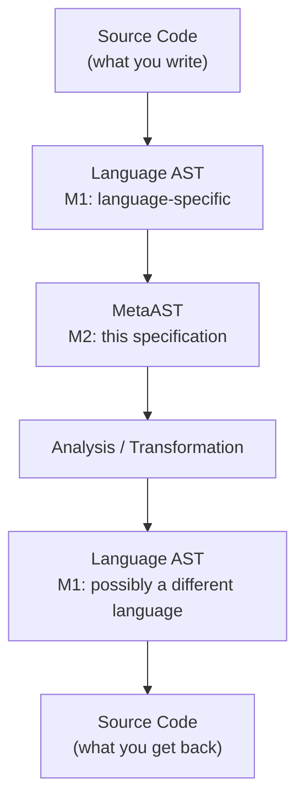

# MetaAST Informal Specification

## What Is MetaAST?

Imagine you speak five languages. You can describe the same idea—“add five
to x”—in English, Russian, Spanish, Mandarin, or Catalan. The words differ,
the grammar differs, but the *meaning* is the same. MetaAST is the meaning.

Every programming language has its own way of representing code internally.
Python has one, JavaScript has another, Elixir has yet another. These internal
representations are called Abstract Syntax Trees (ASTs). A MetaAST is a
*universal* AST—a single, language-independent format that captures the
semantic essence of code regardless of which language it was written in.

This lets you build a tool *once* (such as the [MetaCredo](https://github.com/Oeditus/metacredo) cross-language static analysis and linting library) and run it on Cure, Elixir, Erlang, Haskell, JavaScript, March, Python, Ruby, and TypeScript code without modification.

### The Analogy

Think of it as sheet music. A piano, a guitar, and a violin all produce
different sounds and require different techniques. But the *score*—the
notes, rhythm, dynamics—is the same for all of them. MetaAST is the score;
language-specific ASTs are the instruments.



### The Hierarchy

MetaAST sits at level **M2** in a four-level meta-modeling hierarchy:

- **M3**—The type system. Elixir's `@type` and `@spec`. Defines what types
  themselves *can be*.
- **M2**—MetaAST (this specification). Defines what AST nodes *can be*.
- **M1**—Language-specific ASTs. Python's `ast` module, Elixir's quoted
  expressions, Ruby's parser gem. What specific code *is*.
- **M0**—Runtime execution. What code *does*.

Each level is an instance of the level above it. A Python AST node is an
instance of a MetaAST type, just as a MetaAST type is an instance of an
Elixir typespec.

## For the Elixir Developer

If you work with Elixir, you already know ASTs intimately—every time you
write a macro, you manipulate Elixir's own 3-tuple quoted expressions:

```elixir
quote do: x + 5
# => {:+, [context: Elixir, imports: [{1, Kernel}]], [{:x, [], Elixir}, 5]}
```

MetaAST uses the **exact same shape**—a 3-element tuple—but with
language-neutral semantics:

```elixir
{:binary_op, [category: :arithmetic, operator: :+],
  [{:variable, [], "x"}, {:literal, [subtype: :integer], 5}]}
```

The parallels are deliberate:

- Elixir Quoted Form: `{atom, keyword, list}`—MetaAST: `{type_atom, keyword_meta, children_or_value}`
- Elixir type atoms: `:+`, `:def`, `:if`—MetaAST type atoms: `:binary_op`, `:function_def`, `:conditional`
- Elixir meta: `[context: ..., line: ...]`—MetaAST meta: `[category: ..., operator: ..., line: ...]`
- Children: child AST nodes or values in both

The key differences:

- **Type atoms are semantic, not syntactic.** Where Elixir uses `:+` (the
  operator itself), MetaAST uses `:binary_op` (the *concept* of a binary
  operation) with the operator stored in metadata.
- **Leaf values are explicit.** Elixir inlines literals directly (`5`);
  MetaAST wraps them in `{:literal, [subtype: :integer], 5}` so every node
  is structurally uniform.
- **Variable names are strings.** Since MetaAST must represent variables from
  all languages (including those with naming conventions alien to Elixir),
  names are always binaries: `"x"`, not the atom `:x`.
- **`Macro.traverse/4` has a direct counterpart.** `AST.traverse/4` works
  identically: pre/post callbacks, accumulator, depth-first walk. If you know
  one, you know the other.

### Quick Taste

```elixir
alias Metastatic.{Builder, AST, Validator, Document}

# Parse Python code into MetaAST
{:ok, doc} = Builder.from_source("x + 5", :python)
doc.ast
# => {:binary_op, [category: :arithmetic, operator: :+],
#     [{:variable, [], "x"}, {:literal, [subtype: :integer], 5}]}

# Parse Elixir code into the *same* MetaAST
{:ok, doc2} = Builder.from_source("x + 5", :elixir)
# doc.ast and doc2.ast are semantically equivalent

# Validate conformance
AST.conforms?(doc.ast)  # => true

# Extract all variables
AST.variables(doc.ast)  # => MapSet.new(["x"])

# Traverse (just like Macro.traverse/4)
{_ast, count} = AST.traverse(doc.ast, 0,
  fn node, acc -> {node, acc + 1} end,
  fn node, acc -> {node, acc} end)
# count => 3  (binary_op, variable, literal)
```

---

## Format Specification

### The 3-Tuple

Every MetaAST node is a 3-element tuple:

```elixir
{type_atom, keyword_meta, children_or_value}
```

- **`type_atom`**—An atom identifying the node kind. One of the types
  defined below (`:literal`, `:binary_op`, `:container`, etc.).
- **`keyword_meta`**—A keyword list carrying metadata: source location,
  subtype, operator, semantic hints, M1 context, and so on.
- **`children_or_value`**—For leaf nodes (`:literal`, `:variable`), the
  actual value. For composite nodes, a list of child MetaAST nodes.

There is exactly one exception: the bare atom `:_` represents a wildcard
pattern in pattern matching contexts.

### Metadata Conventions

The keyword list in the second position may contain any of these keys
(all optional unless stated otherwise for a specific node type):

- **`:line`**, **`:col`**, **`:end_line`**, **`:end_col`**—Source location.
- **`:language`**—Source language atom (`:python`, `:elixir`, `:ruby`,
  `:erlang`, `:haskell`). Attached by adapters to structural nodes.
- **`:module`**, **`:function`**, **`:arity`**, **`:visibility`**—M1
  context for Ragex integration. Attached to `:container` and
  `:function_def` nodes.
- **`:op_kind`**—Semantic operation metadata on `:function_call` nodes.
  See [Semantic Enrichment](#semantic-enrichment-op_kind) below.

---

## Three-Layer Architecture

MetaAST organizes node types into three conceptual layers (plus an escape
hatch), reflecting how universal a construct is across programming languages.

### M2.1: Core Layer

Universal concepts present in **all** languages. These are always normalized
to a common representation.

#### `:literal`

A constant value.

```elixir
{:literal, [subtype: subtype_atom], value}
```

**Required metadata:** `:subtype`—one of `:integer`, `:float`, `:string`,
`:boolean`, `:null`, `:symbol`, `:regex`.

The third element is the value itself, whose Elixir type must match the
subtype: integers for `:integer`, floats for `:float`, binaries for `:string`,
booleans for `:boolean`, `nil` for `:null`, atoms for `:symbol`, and any term
for `:regex`.

```elixir
{:literal, [subtype: :integer], 42}
{:literal, [subtype: :string], "hello"}
{:literal, [subtype: :boolean], true}
{:literal, [subtype: :null], nil}
{:literal, [subtype: :symbol], :ok}
{:literal, [subtype: :float], 3.14}
{:literal, [subtype: :regex], ~r/foo/}
```

**Dual shape for `:bytes` (Cure v0.20.0+).** A `:literal` with
`subtype: :bytes` accepts two payload shapes:

- a raw `binary()` value (the historical form; used whenever the source
  bitstring has no specifier grammar or has been serialised by an
  adapter for a downstream target);
- a list of `:bin_segment` MetaAST nodes, mirroring Elixir's
  `<<seg1, seg2, ...>>` surface syntax (see `:bin_segment` below).

```elixir
# Raw bytes payload
{:literal, [subtype: :bytes], <<1, 2, 3>>}

# Segment-list payload (Elixir/Cure): <<x::utf8, rest::binary>>
{:literal, [subtype: :bytes],
  [{:bin_segment, [type: :utf8], [{:variable, [], "x"}]},
   {:bin_segment, [type: :binary], [{:variable, [], "rest"}]}]}
```

Walkers, the conformance validator, and pattern-aware analyzers treat
the segment-list payload as composite: children are traversed, variable
extraction sees `"x"` and `"rest"`, and `Metastatic.AST.path/2` can
locate nodes inside individual segments.

#### `:variable`

A named binding.

```elixir
{:variable, meta, name_string}
```

The third element is always a binary (string). Variable scope is indicated
by the optional `:scope` metadata key:

- `:local`—regular variables (`x`, `name`)
- `:module_attribute`—Elixir module attributes (`@timeout`)
- `:instance`—Ruby instance variables (`@x`)
- `:class`—Ruby class variables (`@@x`)
- `:global`—global variables (Ruby `$var`, Python `global x`)

```elixir
{:variable, [line: 1], "x"}
{:variable, [scope: :module_attribute], "@moduledoc"}
{:variable, [scope: :instance], "@name"}
{:variable, [scope: :global], "$stdout"}
```

#### `:binary_op`

An operation with two operands.

```elixir
{:binary_op, [category: category, operator: op_atom], [left, right]}
```

**Required metadata:** `:category` and `:operator`.

Categories: `:arithmetic`, `:comparison`, `:boolean`, `:range`, `:string`.

```elixir
{:binary_op, [category: :arithmetic, operator: :+],
  [{:variable, [], "x"}, {:literal, [subtype: :integer], 5}]}

{:binary_op, [category: :comparison, operator: :>],
  [{:variable, [], "age"}, {:literal, [subtype: :integer], 18}]}

{:binary_op, [category: :boolean, operator: :and],
  [{:variable, [], "a"}, {:variable, [], "b"}]}

{:binary_op, [category: :range, operator: :..],
  [{:literal, [subtype: :integer], 1}, {:literal, [subtype: :integer], 10}]}

{:binary_op, [category: :string, operator: :<>],
  [{:variable, [], "greeting"}, {:literal, [subtype: :string], " world"}]}
```

#### `:unary_op`

An operation with one operand.

```elixir
{:unary_op, [category: category, operator: op_atom], [operand]}
```

```elixir
{:unary_op, [category: :arithmetic, operator: :-], [{:variable, [], "x"}]}
{:unary_op, [category: :boolean, operator: :not], [{:variable, [], "flag"}]}
```

#### `:function_call`

A function or method invocation.

```elixir
{:function_call, [name: name_string], args_list}
```

**Required metadata:** `:name` (a binary). For method calls, the receiver
is encoded in the name: `"Repo.all"`, `"user.save"`.

```elixir
{:function_call, [name: "add"], [{:variable, [], "x"}, {:variable, [], "y"}]}
{:function_call, [name: "Repo.all"], [{:variable, [], "User"}]}
{:function_call, [name: "IO.puts", line: 5], [{:literal, [subtype: :string], "hello"}]}
```

May carry `:op_kind` metadata for semantic enrichment (see below).

#### `:conditional`

An if/then/else expression.

```elixir
{:conditional, meta, [condition, then_branch, else_branch_or_nil]}
```

The else branch may be `nil` if absent.

```elixir
{:conditional, [],
  [{:binary_op, [category: :comparison, operator: :>],
    [{:variable, [], "x"}, {:literal, [subtype: :integer], 0}]},
   {:literal, [subtype: :string], "positive"},
   {:literal, [subtype: :string], "non-positive"}]}
```

#### `:early_return`

An explicit return statement.

```elixir
{:early_return, meta, [value]}
{:early_return, meta, []}       # return with no value
```

#### `:block`

A sequence of statements.

```elixir
{:block, meta, [statement_1, statement_2, ...]}
```

#### `:list`

An ordered sequence (array, list).

```elixir
{:list, meta, [element_1, element_2, ...]}
```

M1 instances: Python `ast.List`, JavaScript `Array`, Elixir list literal,
Ruby `Array`, Erlang list.

```elixir
{:list, [], []}
{:list, [], [{:literal, [subtype: :integer], 1}, {:literal, [subtype: :integer], 2}]}
```

#### `:map`

A key-value collection. Children are `:pair` nodes.

```elixir
{:map, meta, [pair_1, pair_2, ...]}
```

M1 instances: Python `ast.Dict`, JavaScript `Object` literal, Elixir `%{}`,
Ruby `Hash`, Erlang map.

```elixir
{:map, [], [{:pair, [], [{:literal, [subtype: :string], "name"},
                         {:literal, [subtype: :string], "Alice"}]}]}
```

#### `:pair`

A single key-value association, used inside `:map` nodes.

```elixir
{:pair, meta, [key, value]}
```

#### `:tuple`

A fixed-size ordered group. Used in patterns, destructuring, and languages
with native tuple support.

```elixir
{:tuple, meta, [element_1, element_2, ...]}
```

#### `:assignment`

Imperative binding/mutation (Python, JavaScript, Ruby). The `=` is an
assignment operator.

```elixir
{:assignment, meta, [target, value]}
```

```elixir
{:assignment, [], [{:variable, [], "x"}, {:literal, [subtype: :integer], 5}]}

# Tuple unpacking
{:assignment, [],
  [{:tuple, [], [{:variable, [], "x"}, {:variable, [], "y"}]},
   {:tuple, [], [{:literal, [subtype: :integer], 1}, {:literal, [subtype: :integer], 2}]}]}
```

#### `:inline_match`

Declarative pattern matching (Elixir, Erlang). The `=` is a match operator --
the left side is a pattern that must unify with the right side.

```elixir
{:inline_match, meta, [pattern, value]}
```

```elixir
{:inline_match, [], [{:variable, [], "x"}, {:literal, [subtype: :integer], 5}]}

{:inline_match, [],
  [{:tuple, [], [{:variable, [], "x"}, {:variable, [], "y"}]},
   {:tuple, [], [{:literal, [subtype: :integer], 1}, {:literal, [subtype: :integer], 2}]}]}
```

> **Why two types for `=`?** In Python, `x = 5` *assigns* a value. In
> Elixir, `x = 5` *matches* and *binds*. The distinction matters for analysis:
> an assignment can never fail, but a match can. Collapsing them into one node
> type would lose this semantic difference.

#### `:range`

A numeric or iterable range.

```elixir
{:range, meta, [start, stop]}
```

An optional `:step` key in metadata specifies a step value (as a MetaAST node).

```elixir
{:range, [], [{:literal, [subtype: :integer], 1}, {:literal, [subtype: :integer], 10}]}
{:range, [step: {:literal, [subtype: :integer], 2}],
  [{:literal, [subtype: :integer], 0}, {:literal, [subtype: :integer], 100}]}
```

#### `:string_interpolation`

A string with embedded expressions.

```elixir
{:string_interpolation, meta, [part_1, part_2, ...]}
```

Parts alternate between literal string fragments and expression nodes.

```elixir
# "Hello, #{name}!"
{:string_interpolation, [],
  [{:literal, [subtype: :string], "Hello, "},
   {:variable, [], "name"},
   {:literal, [subtype: :string], "!"}]}
```

#### `:bin_segment`

A single element of a bitstring literal / pattern (Cure v0.20.0+).

```elixir
{:bin_segment, [type: type, signedness: sign, endianness: endian,
                size: size_ast, unit: unit], [value]}
```

**Required children:** a single-element list `[value]`, where `value`
is any conforming MetaAST node.

**Metadata keys** (all optional, mirroring Elixir's bitstring specifier
grammar):

- `:type` -- one of `:integer`, `:float`, `:bits`, `:bitstring`,
  `:bytes`, `:binary`, `:utf8`, `:utf16`, `:utf32`, `:any`.
- `:signedness` -- `:signed` or `:unsigned`.
- `:endianness` -- `:big`, `:little`, or `:native`.
- `:size` -- a MetaAST node (typically a `:literal` integer or a
  `:variable`) giving the segment size.
- `:unit` -- an integer (the Elixir unit multiplier).

Segments appear as children of `{:literal, [subtype: :bytes], [...]}`
nodes. A standalone segment outside of a `:bytes` literal is a malformed
construct and will not round-trip through any adapter.

```elixir
# <<x::utf8>>
{:literal, [subtype: :bytes],
  [{:bin_segment, [type: :utf8], [{:variable, [], "x"}]}]}

# <<size::integer-size(8), rest::binary>>
{:literal, [subtype: :bytes],
  [{:bin_segment,
     [type: :integer, size: {:literal, [subtype: :integer], 8}],
     [{:variable, [], "size"}]},
   {:bin_segment, [type: :binary], [{:variable, [], "rest"}]}]}
```

#### `:comment`

A trivia source comment (Cure v0.20.0+).

```elixir
{:comment, [comment_kind: kind], text}
```

**Required value:** `text` must be a binary (string).

**Metadata keys:**

- `:comment_kind` -- `:line` (default; plain `#` or `//`), `:doc`
  (Elixir `@doc` / Cure `##` / `###`), or `:block` (C-style
  `/* ... */`).
- `:line`, `:col`, `:end_line`, `:end_col` -- standard location keys.

```elixir
{:comment, [comment_kind: :line, line: 10], "TODO: revisit"}
{:comment, [comment_kind: :doc, line: 5], "Public API entry point"}
```

Comments are *trivia*: type checkers, codegens, and the majority of
analyzers skip them without visiting the children (there are none).
Formatters, documentation extractors, and round-trip tooling preserve
them to reproduce source faithfully.

#### `:_` (wildcard)

The bare atom `:_` represents a catch-all pattern in pattern matching.

---

### M2.2: Extended Layer

Common patterns present in **most** languages. Normalized with optional hints
to preserve language-specific nuances.

#### `:loop`

A looping construct. The `:loop_type` metadata distinguishes variants.

```elixir
# While loop: condition + body
{:loop, [loop_type: :while], [condition, body]}

# For / for-each loop: iterator + collection + body
{:loop, [loop_type: :for], [iterator, collection, body]}
{:loop, [loop_type: :for_each], [iterator, collection, body]}
```

```elixir
{:loop, [loop_type: :while],
  [{:binary_op, [category: :comparison, operator: :>],
    [{:variable, [], "x"}, {:literal, [subtype: :integer], 0}]},
   {:block, [], [{:variable, [], "x"}]}]}

{:loop, [loop_type: :for],
  [{:variable, [], "item"}, {:variable, [], "items"},
   {:function_call, [name: "process"], [{:variable, [], "item"}]}]}
```

#### `:lambda`

An anonymous function / closure.

```elixir
{:lambda, [params: param_list, captures: capture_list], body_list}
```

Params are `:param` nodes (see M2.2s). Captures list the closed-over
variables (may be empty).

```elixir
{:lambda, [params: [{:param, [], "x"}, {:param, [], "y"}], captures: []],
  [{:binary_op, [category: :arithmetic, operator: :+],
    [{:variable, [], "x"}, {:variable, [], "y"}]}]}
```

#### `:collection_op`

A higher-order collection operation (map, filter, reduce, etc.).

```elixir
# Map / filter: function + collection
{:collection_op, [op_type: :map], [function, collection]}
{:collection_op, [op_type: :filter], [function, collection]}

# Reduce: function + collection + initial accumulator
{:collection_op, [op_type: :reduce], [function, collection, initial]}
```

```elixir
{:collection_op, [op_type: :map],
  [{:lambda, [params: [{:param, [], "x"}], captures: []],
    [{:binary_op, [category: :arithmetic, operator: :*],
      [{:variable, [], "x"}, {:literal, [subtype: :integer], 2}]}]},
   {:variable, [], "numbers"}]}
```

#### `:pattern_match`

A multi-branch pattern match (Elixir `case`, Ruby `case/when`, Python
`match/case`).

```elixir
{:pattern_match, meta, [scrutinee, arm_1, arm_2, ...]}
```

Children: the first element is the scrutinee (the value being matched);
the rest are `:match_arm` nodes.

#### `:match_arm`

A single branch in a pattern match or exception handler.

```elixir
{:match_arm, [pattern: pattern_ast, guard: guard_or_nil], body_list}
```

**Required metadata:** `:pattern` (a MetaAST node or `:_` for catch-all).
**Optional metadata:** `:guard` (a guard expression, or `nil`).

```elixir
{:pattern_match, [],
  [{:variable, [], "value"},
   {:match_arm, [pattern: {:literal, [subtype: :integer], 0}],
    [{:literal, [subtype: :string], "zero"}]},
   {:match_arm, [pattern: {:literal, [subtype: :integer], 1}],
    [{:literal, [subtype: :string], "one"}]},
   {:match_arm, [pattern: :_],
    [{:literal, [subtype: :string], "other"}]}]}
```

#### `:exception_handling`

A try/catch/finally construct.

```elixir
{:exception_handling, meta, [try_block, handlers_list, finally_or_nil]}
```

The `handlers_list` is a list of `:match_arm` nodes. The finally block may
be `nil`.

```elixir
{:exception_handling, [],
  [{:block, [], [{:function_call, [name: "risky"], []}]},
   [{:match_arm, [pattern: {:variable, [], "e"}],
     [{:function_call, [name: "handle"], [{:variable, [], "e"}]}]}],
   {:function_call, [name: "cleanup"], []}]}
```

#### `:async_operation`

An async/await construct.

```elixir
{:async_operation, [op_type: :await], [operation]}
{:async_operation, [op_type: :async], [operation]}
```

#### `:comprehension`

A list/set/dict comprehension (Python, Elixir `for`, Haskell list
comprehensions).

```elixir
{:comprehension, meta, [body, generator_or_filter_1, generator_or_filter_2, ...]}
```

The first child is the body expression (what gets collected). The remaining
children are `:generator` and `:filter` nodes.

```elixir
# [x * 2 for x in range(10) if x > 3]
{:comprehension, [],
  [{:binary_op, [category: :arithmetic, operator: :*],
    [{:variable, [], "x"}, {:literal, [subtype: :integer], 2}]},
   {:generator, [],
    [{:variable, [], "x"},
     {:function_call, [name: "range"], [{:literal, [subtype: :integer], 10}]}]},
   {:filter, [],
    [{:binary_op, [category: :comparison, operator: :>],
      [{:variable, [], "x"}, {:literal, [subtype: :integer], 3}]}]}]}
```

#### `:generator`

An iterator binding inside a comprehension.

```elixir
{:generator, meta, [variable, collection]}
```

#### `:filter`

A guard condition inside a comprehension.

```elixir
{:filter, meta, [condition]}
```

---

### M2.2s: Structural / Organizational Layer

Top-level constructs for organizing code into modules, classes, and
functions. These are part of the extended layer but grouped separately
because they represent *structure* rather than *computation*.

#### `:container`

A module, class, or namespace.

```elixir
{:container, [container_type: type, name: name_string, ...], body_list}
```

**Required metadata:** `:container_type` (`:module`, `:class`, or
`:namespace`) and `:name` (binary).

**Common metadata:** `:language`, `:line`, `:module` (M1 context).

```elixir
# Elixir module
{:container,
  [container_type: :module, name: "MyApp.Math",
   module: "MyApp.Math", language: :elixir, line: 1],
  [function_def_1, function_def_2]}

# Python class
{:container,
  [container_type: :class, name: "Calculator",
   language: :python, line: 1],
  [function_def_init, function_def_add]}
```

#### `:function_def`

A function or method definition.

```elixir
{:function_def, [name: name, params: param_list, visibility: vis, ...], body_list}
```

**Required metadata:** `:name` (binary), `:params` (list of `:param` nodes).

**Common metadata:** `:visibility` (`:public`, `:private`, `:protected`),
`:arity` (integer), `:guards` (guard expression MetaAST or `nil`),
`:function`, `:language`, `:line`.

**Enrichment metadata** (added by `Semantic.Enricher` during tree
enrichment, not by adapters directly):

- `:callback_for` (binary) -- The behaviour or base-class module name
  whose callback this function implements. Present only when the
  enclosing `:container` declares a known behaviour (via `:import`
  children or `:parent` metadata) and the function name/arity matches
  a registered callback in `Semantic.Callbacks`. Examples:
  `"Oban.Worker"`, `"GenServer"`, `"ActiveJob::Base"`.

```elixir
# def add(x, y), do: x + y
{:function_def,
  [name: "add",
   params: [{:param, [], "x"}, {:param, [], "y"}],
   visibility: :public, arity: 2],
  [{:binary_op, [category: :arithmetic, operator: :+],
    [{:variable, [], "x"}, {:variable, [], "y"}]}]}

# def positive?(x) when x > 0, do: true
{:function_def,
  [name: "positive?",
   params: [{:param, [], "x"}],
   visibility: :public, arity: 1,
   guards: {:binary_op, [category: :comparison, operator: :>],
     [{:variable, [], "x"}, {:literal, [subtype: :integer], 0}]}],
  [{:literal, [subtype: :boolean], true}]}

# Oban worker perform/1 (after enrichment)
{:function_def,
  [name: "perform",
   params: [{:param, [], "job"}],
   visibility: :public, arity: 1,
   callback_for: "Oban.Worker"],
  [body_ast]}
```

#### `:param`

A function parameter.

```elixir
{:param, [pattern: pattern_or_nil, default: default_or_nil], name_string}
```

The third element is the parameter name (binary). Optional metadata:

- `:pattern`—a MetaAST node for destructured parameters
- `:default`—a MetaAST node for the default value
- `:rest`—`true` for rest/splat parameters (`*args`)
- `:keyword`—`true` for keyword arguments
- `:keyword_rest`—`true` for keyword rest (`**kwargs`)
- `:block`—`true` for block parameters (`&block`)

```elixir
{:param, [], "x"}
{:param, [default: {:literal, [subtype: :string], "World"}], "name"}
{:param, [rest: true], "args"}
{:param, [keyword: true, default: {:literal, [subtype: :integer], 0}], "timeout"}
{:param, [keyword_rest: true], "opts"}
{:param, [block: true], "callback"}
```

#### `:attribute_access`

A field/property/member access.

```elixir
{:attribute_access, [attribute: name_string], [receiver]}
```

**Required metadata:** `:attribute` (binary).

Optional `:null_safe` key (`true` for Ruby's `&.` operator).

```elixir
{:attribute_access, [attribute: "value"], [{:variable, [], "obj"}]}

# Chained: user.address.street
{:attribute_access, [attribute: "street"],
  [{:attribute_access, [attribute: "address"], [{:variable, [], "user"}]}]}

# Ruby safe navigation: user&.name
{:attribute_access, [attribute: "name", null_safe: true], [{:variable, [], "user"}]}
```

#### `:augmented_assignment`

A compound assignment operator (`+=`, `-=`, `*=`, `||=`, etc.).

```elixir
{:augmented_assignment, [operator: op_atom], [target, value]}
```

Optional `:category` metadata (`:arithmetic`, `:boolean`, etc.).

```elixir
{:augmented_assignment, [operator: :+],
  [{:variable, [], "x"}, {:literal, [subtype: :integer], 5}]}

# Ruby memoization: @user ||= User.find(1)
{:augmented_assignment, [category: :boolean, operator: :"||="],
  [{:variable, [scope: :instance], "@user"},
   {:function_call, [name: "User.find"], [{:literal, [subtype: :integer], 1}]}]}
```

#### `:property`

A getter/setter declaration.

```elixir
{:property, [name: name_string], [getter_or_nil, setter_or_nil]}
```

```elixir
# Ruby attr_reader :name
{:property, [name: "name"],
  [{:function_def, [name: "name", params: [], visibility: :public],
    [{:variable, [scope: :instance], "@name"}]},
   nil]}
```

#### `:import`

A module/package dependency directive. Unifies `import`, `use`, `require`,
`alias`, `include`, and equivalent constructs across all languages.

```elixir
{:import, [source: module_string, import_type: type_atom, ...], []}
```

**Required metadata:** `:source` (binary—the module/package name) and
`:import_type` (atom preserving the original directive).

**Import types by language:**

- **Elixir:** `:import`, `:use`, `:require`, `:alias`
- **Python:** `:import`
- **Ruby:** `:require`, `:include`
- **Haskell:** `:import`
- **Erlang:** `:import`

Optional `:names` metadata—a list of specific names imported (for
selective imports like Python's `from X import a, b`).

```elixir
{:import, [source: "GenServer", import_type: :use, language: :elixir], []}
{:import, [source: "Logger", import_type: :require, language: :elixir], []}
{:import, [source: "os.path", import_type: :import, language: :python, names: ["join", "exists"]], []}
```

#### `:type_annotation`

A type declaration, spec, or hint.

```elixir
{:type_annotation, [annotation_type: type_atom], children_list}
```

**Required metadata:** `:annotation_type`—one of `:spec`, `:type`,
`:hint`, `:callback`.

```elixir
# @spec add(integer(), integer()) :: integer()
{:type_annotation, [annotation_type: :spec], [spec_ast_children]}

# Python type hint: x: int = 5
{:type_annotation, [annotation_type: :hint], [target, type_expression]}
```

---

### M2.3: Native Layer

When a language construct has no reasonable cross-language abstraction, it is
preserved as-is with a semantic hint. This is the escape hatch—it
sacrifices universality to avoid losing information.

#### `:language_specific`

```elixir
{:language_specific, [language: lang_atom, hint: hint_atom], native_ast}
```

**Required metadata:** `:language` (source language atom).

**Recommended metadata:** `:hint` (a semantic hint atom like
`:comprehension`, `:pipe`, `:with`, `:decorator`, `:macro`).

The third element is the language's native AST—its structure is
language-dependent and opaque to cross-language tools.

```elixir
# Elixir pipe operator
{:language_specific, [language: :elixir, hint: :pipe],
  {:|>, [], [left_ast, right_ast]}}

# Elixir with expression
{:language_specific, [language: :elixir, hint: :with],
  {:with, [], clauses}}

# Python decorator
{:language_specific, [language: :python, hint: :decorator],
  %{name: "cache", args: []}}
```

Analysis tools that encounter `:language_specific` nodes can:
1. Use the `:hint` to apply partial analysis.
2. Skip the node gracefully.
3. Delegate to a language-specific handler.

---

## Semantic Enrichment (op_kind)

Function call nodes may carry an `:op_kind` metadata key—a keyword list
that describes *what the function does* at a semantic level, independent of
its name or the framework it belongs to.

This lets analyzers reason about code meaning ("is this a database read?")
rather than pattern-matching on function names ("does this look like
`Repo.get`?").

### Structure

```elixir
{:function_call,
  [name: "Repo.get",
   op_kind: [domain: :db, operation: :retrieve, target: "User", framework: :ecto]],
  [args...]}
```

**Fields:**

- **`:domain`** (required)—The semantic domain. One of:
  `:db`, `:http`, `:auth`, `:cache`, `:queue`, `:file`, `:external_api`.
- **`:operation`** (required)—The specific operation within the domain.
  Examples: `:retrieve`, `:retrieve_all`, `:create`, `:update`, `:delete`,
  `:query`, `:transaction`, `:preload`, `:aggregate`.
- **`:target`** (optional)—The entity being operated on. `"User"`,
  `"orders"`, `"session"`.
- **`:async`** (optional)—Whether the operation is asynchronous.
- **`:framework`** (optional)—The source framework. `:ecto`, `:django`,
  `:sequelize`, `:sqlalchemy`.

### Usage Pattern

Analyzers use a semantic-first, heuristic-fallback approach:

```elixir
def analyze({:function_call, meta, _args} = node, _context) when is_list(meta) do
  op_kind = Keyword.get(meta, :op_kind)

  db_operation? =
    case op_kind do
      kw when is_list(kw) -> OpKind.db?(kw)       # accurate
      nil -> database_function?(Keyword.get(meta, :name, ""))  # fallback
    end

  if db_operation?, do: flag_issue(node)
end
```

### Helper Functions

```elixir
# Domain checks
OpKind.db?(op_kind)     # true if domain is :db
OpKind.http?(op_kind)   # true if domain is :http
OpKind.file?(op_kind)   # true if domain is :file

# Field access
OpKind.domain(op_kind)     # => :db
OpKind.operation(op_kind)  # => :retrieve
OpKind.target(op_kind)     # => "User"

# Operation classification
OpKind.read?(op_kind)   # true for :retrieve, :retrieve_all, :query
OpKind.write?(op_kind)  # true for :create, :update, :delete
```

---

## Semantic Equivalence

Different language ASTs that represent the same semantic concept produce
**identical** MetaAST nodes. This is the fundamental property that enables
cross-language tooling.

```
Python:     x + 5
JavaScript: x + 5
Elixir:     x + 5
Ruby:       x + 5

All produce the same M2:
{:binary_op, [category: :arithmetic, operator: :+],
  [{:variable, [], "x"}, {:literal, [subtype: :integer], 5}]}
```

A more involved example—a function definition:

```
Python:
    def add(x, y):
        return x + y

Elixir:
    def add(x, y), do: x + y

Ruby:
    def add(x, y)
      x + y
    end

All produce:
{:function_def,
  [name: "add",
   params: [{:param, [], "x"}, {:param, [], "y"}],
   visibility: :public, arity: 2],
  [{:binary_op, [category: :arithmetic, operator: :+],
    [{:variable, [], "x"}, {:variable, [], "y"}]}]}
```

(In practice, Python wraps the body in `{:early_return, ...}` and the
languages differ in metadata like `:language` and `:line`, but the
*structural shape* is equivalent.)

---

## Traversal and Manipulation

`Metastatic.AST` provides traversal functions modeled directly on
`Macro.traverse/4`:

```elixir
# Full traversal with pre and post callbacks
AST.traverse(ast, acc, &pre/2, &post/2)

# Pre-order only (post is identity)
AST.prewalk(ast, acc, &pre/2)

# Post-order only (pre is identity)
AST.postwalk(ast, acc, &post/2)
```

### Accessors

```elixir
AST.type(node)          # => :binary_op
AST.meta(node)          # => [category: :arithmetic, operator: :+]
AST.children(node)      # => [left, right]
AST.get_meta(node, :line)       # => 10
AST.put_meta(node, :line, 10)   # => updated node
AST.update_meta(node, line: 10, col: 5)
AST.update_children(node, new_children)
```

### Conformance

```elixir
AST.conforms?(ast)  # => true if valid MetaAST
```

### Extraction

```elixir
AST.variables(ast)  # => MapSet.new(["x", "y"])
AST.location(ast)   # => %{line: 10, col: 5} or nil
AST.metadata(ast)   # => full keyword list
```

### M1 Context

```elixir
AST.with_context(node, %{module: "MyApp", function: "create", arity: 2})
AST.node_module(node)      # => "MyApp"
AST.node_function(node)    # => "create"
AST.node_arity(node)       # => 2
AST.node_visibility(node)  # => :public
```

---

## Node Type Reference

### M2.1 Core (all languages)

`:literal`, `:variable`, `:binary_op`, `:unary_op`, `:function_call`,
`:conditional`, `:early_return`, `:block`, `:list`, `:map`, `:pair`,
`:tuple`, `:assignment`, `:inline_match`, `:range`,
`:string_interpolation`, `:bin_segment`, `:comment`

### M2.2 Extended (most languages)

`:loop`, `:lambda`, `:collection_op`, `:pattern_match`, `:match_arm`,
`:exception_handling`, `:async_operation`, `:comprehension`, `:generator`,
`:filter`

### M2.2s Structural (organizational)

`:container`, `:function_def`, `:param`, `:attribute_access`,
`:augmented_assignment`, `:property`, `:import`, `:type_annotation`

### M2.3 Native (language-specific)

`:language_specific`

### Special

`:_` (wildcard pattern—bare atom, not a 3-tuple)
