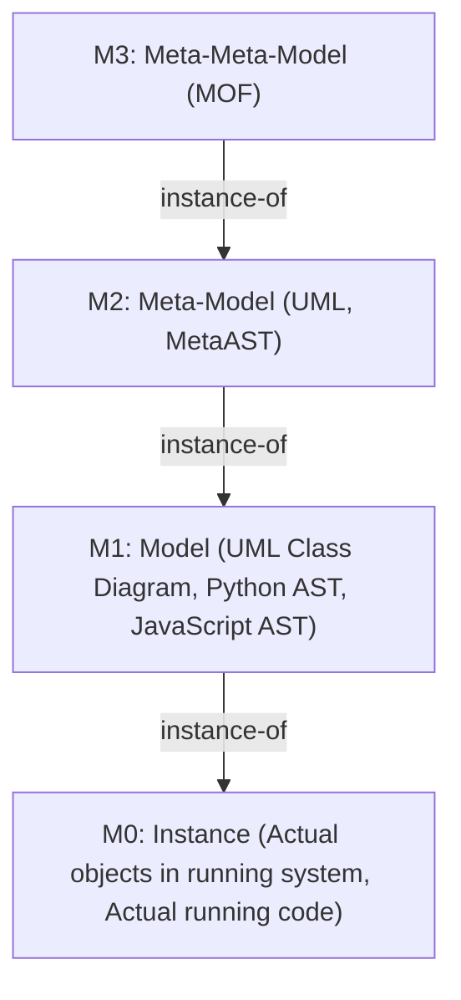

# MetaAST Research: Cross-Language AST Transformation

## Executive Summary

This document analyzes the feasibility and design of a **MetaAST** (Meta-level Abstract Syntax Tree) library that enables cross-language code analysis, mutation testing, and transformation through a unified intermediate representation.

**Key Finding:** A layered MetaAST approach is **viable and valuable**, offering 80/20 coverage of common code patterns while maintaining manageable complexity.

**Recommended Approach:** Three-layer architecture (Core, Extended, Native) rather than a complete superset AST.

---

## Research Context

Based on analysis of two existing multi-language code analysis projects:
- **muex**: Mutation testing framework for Elixir/Erlang
- **propwise**: Property-based testing candidate identification

Both projects identified the challenge of extending to multiple programming languages beyond the BEAM ecosystem.

---

## Meta-Modeling Theory: Understanding MetaAST's True Nature

### The Meta-Hierarchy (MOF Perspective)

MetaAST operates as a **true meta-model** in the formal sense of meta-modeling hierarchies, similar to MOF (Meta-Object Facility) and UML:



### MetaAST as M2 (Meta-Model Level)

**MetaAST is NOT:**
- ❌ A common intermediate representation (that would be M1)
- ❌ A union of all language ASTs (that would be M1)
- ❌ Just another AST format (that would be M1)

**MetaAST IS:**
- ✅ A **meta-model** that defines the abstract syntax of programming language constructs
- ✅ A **model of models** - it models what an AST can be
- ✅ At the same abstraction level as UML or MOF

### Concrete Example: The Meta-Hierarchy in Action

```
M3 Level (Meta-Meta-Model):
  "A node type can have a name and attributes"
  → This is what MetaAST's type system definition represents

M2 Level (Meta-Model) - MetaAST:
  {:binary_op, category, operator, left, right}
  → This DEFINES what a binary operation IS across all languages

M1 Level (Model) - Language-Specific ASTs:
  Python:  BinOp(op=Add(), left=Name('x'), right=Num(5))
  JavaScript: BinaryExpression(operator: '+', left: Identifier('x'), right: Literal(5))
  Elixir:  {:+, [], [{:x, [], nil}, 5]}
  → These are INSTANCES of the M2 binary_op concept

M0 Level (Instance) - Runtime:
  x = 10; result = x + 5  → evaluates to 15
  → This is the actual execution
```

### Why This Matters

#### 1. Semantic Equivalence Through Meta-Level Abstraction

Different M1 models (Python AST, JS AST, Elixir AST) can be **instances of the same M2 concept**:

```elixir
# M2: Meta-model definition
@type binary_op :: {:binary_op, category(), op :: atom, left :: node, right :: node}

# M1: Instances in different languages are MODELS of this meta-model
python_add   = {:binary_op, :arithmetic, :+, left, right}  # Instance of M2
js_add       = {:binary_op, :arithmetic, :+, left, right}  # Same instance!
elixir_add   = {:binary_op, :arithmetic, :+, left, right}  # Same instance!

# They are the SAME at M2 level, different only at M1 (concrete syntax)
```

#### 2. Transformations Operate at Meta-Level

Mutations, purity analysis, and other transformations operate **on the meta-model (M2)**, not on individual models (M1):

```elixir
# This transformation operates at M2 level:
def arithmetic_inverse(meta_ast) do
  transform({:binary_op, :arithmetic, :+, l, r}) → {:binary_op, :arithmetic, :-, l, r}
end

# It automatically applies to ALL M1 instances:
# - Python AST → mutated Python AST
# - JavaScript AST → mutated JavaScript AST
# - Elixir AST → mutated Elixir AST
#
# Because they all instantiate the SAME M2 concept!
```

#### 3. Language Adapters Are M1 ↔ M2 Mappings

Language adapters perform **model-to-meta-model transformations**:

```elixir
# M1 → M2 (Abstraction)
defmodule Metastatic.Adapters.Python do
  # Takes M1 (Python-specific AST)
  def to_meta(%{"_type" => "BinOp", "op" => "Add", ...} = python_ast) do
    # Returns M2 (language-independent meta-model)
    {:ok, {:binary_op, :arithmetic, :+, left, right}, metadata}
  end
end

# M2 → M1 (Reification/Instantiation)
def from_meta({:binary_op, :arithmetic, :+, left, right}, metadata) do
  # Takes M2 (meta-model)
  # Returns M1 (Python-specific AST)
  {:ok, %{"_type" => "BinOp", "op" => "Add", ...}}
end
```

### Comparison with MOF/UML

| Aspect | MOF/UML | MetaAST |
|--------|---------|----------|
| **M3 Level** | MOF (Meta-Object Facility) | Elixir type system + MetaAST.AST module |
| **M2 Level** | UML (Unified Modeling Language) | MetaAST core types |
| **M1 Level** | Class diagrams, sequence diagrams | Python AST, JavaScript AST, Elixir AST |
| **M0 Level** | Actual objects in running system | Actual code execution |
| **Purpose** | Model software structure | Model program syntax/semantics |
| **Instantiation** | Diagram → Code | MetaAST → Language AST → Source |

### The Three-Layer Architecture as Meta-Levels

Our three-layer design actually represents **different granularities within M2**:

```
M2.1 (Core Layer):
  - Universal programming concepts (exists in ALL languages)
  - {:literal, :variable, :binary_op, :conditional, ...}
  - 100% language-independent
  
M2.2 (Extended Layer):
  - Common patterns (exists in MOST languages, with variations)
  - {:loop, :lambda, :pattern_match, ...}
  - Language-independent but with metadata hints
  
M2.3 (Native Layer):
  - Language-specific constructs (embedded M1 fragments)
  - {:language_specific, language, native_ast, semantic_hint}
  - Escape hatch for M1-level information that can't be lifted to M2
```

### Why "Metastatic" - The Complete Etymology

The name **Metastatic** encodes multiple layers of meaning through linguistic wordplay:

#### 1. Met(a) + AST-atic
**"Meta" + "AST" + "-atic" (suffix meaning "relating to")**

- Literally: "relating to meta-level ASTs"
- Emphasizes that we work with Abstract Syntax Trees at the meta-level
- The AST is hidden in plain sight within the word itself

#### 2. Meta + Static
**"Meta-level" + "Static analysis"**

- **Meta-level**: M2 in the MOF hierarchy (meta-model level)
- **Static**: Compile-time/analysis-time (as opposed to runtime/M0)
- Together: "Static analysis operating at the meta-level"

#### 3. Metastatic (Biological Metaphor)
**Spreading/Propagating across sites**

- In medicine: metastasis = spread of change from one site to many
- In Metastatic: A transformation at M2 level automatically propagates to all M1 instances
- One mutation at meta-level "spreads" to Python, JavaScript, Elixir, Rust, etc.
- Like biological metastasis: **one change, many affected sites**

#### The Triple Pun

The name works on all three levels simultaneously:

```
Metastatic = Met(a) + AST + -atic
           = Meta + Static
           = Metastatic (spreading)
```

This triple meaning perfectly captures what the library does:
- Works with **ASTs** at the **meta-level**
- Performs **static** analysis at the **meta** level  
- **Spreads** transformations from M2 to all M1 instances

### Implications for Implementation

#### 1. Type Safety at Meta-Level

MetaAST types should be defined as **meta-types** that constrain M1 instances:

```elixir
defmodule Metastatic.AST do
  @moduledoc """
  M2: Meta-model for programming language abstract syntax.
  
  This module defines the meta-types that all language ASTs (M1) must conform to.
  Think of this as the "UML" for programming language ASTs.
  """
  
  # This is an M2 type definition (meta-type)
  @type node :: ...  
end
```

#### 2. Adapters Validate Conformance

Language adapters ensure M1 models **conform to the M2 meta-model**:

```elixir
def to_meta(language_ast) do
  meta_ast = transform(language_ast)
  
  # Validate that M1 instance conforms to M2 meta-model
  case Metastatic.Validator.validate_conformance(meta_ast) do
    :ok -> {:ok, meta_ast, metadata}
    {:error, reason} -> {:error, "M1 does not conform to M2: #{reason}"}
  end
end
```

#### 3. Transformations Are Meta-Level Operations

Mutations and analyses are **meta-level functions** (M2 → M2):

```elixir
@spec mutate(MetaAST.node()) :: [MetaAST.node()]
def mutate(meta_ast) do
  # This operates on M2 (meta-model)
  # Returns transformed M2
  # Automatically applicable to all M1 instances
end
```

### Academic Foundation

This approach is grounded in formal meta-modeling theory:

**References:**
- **MOF (Meta-Object Facility)** - OMG standard for meta-modeling
- **Ecore** - Eclipse's meta-meta-model
- **MDA (Model-Driven Architecture)** - OMG's transformation framework
- **Abstract Syntax** - Separation of syntax from semantics

MetaAST applies these principles to **cross-language program analysis**.

### Key Insight: Metacircular Interpretation

In the same way that:
- **MOF** is meta to **UML**
- **UML** is meta to **Class Diagrams**  
- **Class Diagrams** are meta to **Running Objects**

We have:
- **Elixir Type System** is meta to **MetaAST**
- **MetaAST** is meta to **Language ASTs** (Python, JS, Elixir)
- **Language ASTs** are meta to **Source Code**
- **Source Code** is meta to **Execution**

This **metacircular** property means transformations at M2 automatically apply to all M1 instances, which is exactly what we want for cross-language analysis.

### Practical Advantage

Because MetaAST is at M2, not M1:

```elixir
# Write transformation ONCE at M2 level:
def remove_dead_code(meta_ast) do
  # Operates on meta-model
end

# Apply to ANY language (M1 instances) automatically:
remove_dead_code(python_ast)     # Works!
remove_dead_code(javascript_ast)  # Works!
remove_dead_code(elixir_ast)      # Works!
remove_dead_code(rust_ast)        # Works!

# Because they all INSTANTIATE the same M2 concepts
```

This is the **true power** of meta-modeling: **write once, apply everywhere** - not through code reuse, but through **meta-level abstraction**.

---

## Problem Space

### The Challenge

How can we build tools that work across multiple programming languages without:
1. Duplicating analysis logic for each language
2. Losing language-specific semantic information
3. Creating unmaintainable complexity
4. Requiring excessive runtime dependencies

### Initial Approaches Considered

#### Approach 1: Language-Specific Implementations
**Status:** Current approach in muex/propwise
- ✅ Maintains full semantic fidelity
- ✅ Idiomatic to each language
- ❌ Massive code duplication
- ❌ Inconsistent behavior across languages

#### Approach 2: Direct AST Normalization (LANG → Elixir AST → LANG)
**Status:** Rejected
- ❌ Extreme semantic complexity
- ❌ Information loss (lifetimes, async/await, type systems)
- ❌ AST structure impedance mismatch
- ❌ 7-step transformation overhead
- ❌ Maintenance nightmare as languages evolve

---

## MetaAST Approaches

### Option A: Superset AST (Union of All Features)

#### Concept
Create an AST containing ALL possible constructs from every supported language.

```elixir
defmodule SupersetAST do
  @type node ::
    # Common (10%)
    {:literal, type :: atom, value :: term} |
    {:variable, name :: String.t} |
    
    # Python-specific
    {:list_comprehension, expr :: node, generators :: [node]} |
    {:decorator, name :: String.t, target :: node} |
    
    # JavaScript-specific  
    {:arrow_function, params :: [node], body :: node} |
    {:jsx_element, tag :: String.t, props :: map, children :: [node]} |
    
    # Rust-specific
    {:lifetime_annotation, name :: String.t, expr :: node} |
    {:borrow, kind :: :shared | :mutable, expr :: node} |
    
    # Go-specific
    {:goroutine, expr :: node} |
    {:defer, expr :: node} |
    
    # ... 500+ more node types
end
```

#### Analysis

**Pros:**
- Complete language coverage
- No information loss
- Perfect round-tripping
- Theoretical language migration capability

**Cons:**
- **Explosive complexity**: 400-600 distinct node types
- **90% dead code**: Most nodes unused for any given language
- **Semantic mapping hell**: Fundamentally different concepts (Promises vs goroutines vs async/await)
- **Mutation validity**: Valid mutations in one language invalid in another
- **Maintenance burden**: Every language evolution breaks the superset

**Verdict:** ❌ **NOT RECOMMENDED** - Complexity far exceeds benefits

---

### Option B: Meta-Level AST (Abstract Semantic Representation)

#### Concept
Represent only **semantic categories** that exist across languages, not language-specific syntax.

```elixir
defmodule MetaAST do
  @moduledoc """
  Language-agnostic semantic representation.
  Only includes concepts that exist in ALL or MOST languages.
  """
  
  @type node ::
    # Values
    {:literal, semantic_type(), value :: term} |
    {:variable, name :: String.t} |
    {:collection, kind :: :sequence | :mapping, elements :: [node]} |
    
    # Operations
    {:binary_op, category :: :arithmetic | :comparison | :logical, 
                 op :: atom, left :: node, right :: node} |
    {:unary_op, op :: atom, operand :: node} |
    
    # Control flow
    {:conditional, condition :: node, then_branch :: node, else_branch :: node} |
    {:loop, kind :: :while | :for | :infinite, condition :: node, body :: node} |
    {:early_return, kind :: :return | :break | :continue, value :: node | nil} |
    
    # Functions
    {:function_def, name :: String.t, params :: [param], body :: node} |
    {:function_call, target :: node, args :: [node]} |
    {:lambda, params :: [param], body :: node} |
    
    # Collections operations (mutation testing sweet spot)
    {:map, fn :: node, collection :: node} |
    {:filter, predicate :: node, collection :: node} |
    {:reduce, fn :: node, initial :: node, collection :: node} |
    
    # Side effects (for purity analysis)
    {:io_operation, kind :: :read | :write | :print, args :: [node]} |
    {:mutation, target :: node, value :: node} |
    {:external_call, kind :: :http | :db | :filesystem, details :: map} |
    
    # Escape hatch for language-specific constructs
    {:language_specific, language :: atom, native_ast :: term, 
                         semantic_hint :: atom | nil}

  @type semantic_type :: 
    :integer | :float | :string | :boolean | :null |
    :symbol | :regex | :collection
    
  @type param :: {:param, name :: String.t, type_hint :: String.t | nil}
end
```

#### Key Insight: Semantic Equivalence

Different syntax, same semantics → same MetaAST:

```elixir
# Python list comprehension
[x * 2 for x in numbers if x > 0]

# JavaScript method chaining
numbers.filter(x => x > 0).map(x => x * 2)

# Rust iterator chain
numbers.iter().filter(|x| x > &0).map(|x| x * 2).collect()

# All map to IDENTICAL MetaAST:
{:map, 
  {:lambda, [{:param, "x", nil}], 
    {:binary_op, :arithmetic, :*, {:variable, "x"}, {:literal, :integer, 2}}},
  {:filter,
    {:lambda, [{:param, "x", nil}], 
      {:binary_op, :comparison, :>, {:variable, "x"}, {:literal, :integer, 0}}},
    {:variable, "numbers"}
  }
}
```

#### Analysis

**Pros:**
- ✅ **Manageable complexity**: 30-50 node types vs 500+
- ✅ **80/20 coverage**: Most valuable mutations are in common core
- ✅ **Cross-language patterns**: Purity analysis works uniformly
- ✅ **Incremental support**: Add languages gradually
- ✅ **Shared logic**: Mutations/analysis written once

**Cons:**
- ⚠️ **Language-specific features need custom handling**
  - *Mitigation*: `:language_specific` escape hatch
- ⚠️ **Lossy for translation**: Can't perfectly translate Python → Rust
  - *Mitigation*: Goal is analysis/mutation, not translation
- ⚠️ **Still need language adapters**
  - *Mitigation*: But analysis logic is shared - big win
- ⚠️ **Edge case complexity**: Different semantics (e.g., `"hello" * 3` in Python vs JavaScript)
  - *Mitigation*: Language-specific validation layer

**Verdict:** ✅ **RECOMMENDED** - Practical balance of abstraction and specificity

---

## Recommended Architecture: Layered MetaAST

### Three-Layer Design

Combine benefits of both approaches with stratified normalization:

```elixir
defmodule LayeredMetaAST do
  @moduledoc """
  Three-layer architecture for optimal abstraction/fidelity balance.
  
  Layer 1: Core - Always normalize (common to 90% of code)
  Layer 2: Extended - Normalize with hints (common patterns with variations)
  Layer 3: Native - Preserve as-is (language-specific constructs)
  """
  
  # Layer 1: Core (always normalize these)
  @core_patterns [
    :literal,           # Values: 42, "hello", true
    :variable,          # Identifiers: x, foo_bar
    :binary_op,         # Operators: +, -, *, /, ==, <, &&
    :unary_op,          # Operators: -, !, not
    :function_call,     # Calls: foo(x, y)
    :conditional,       # If/else, ternary
    :return             # Early returns
  ]
  
  # Layer 2: Extended (normalize when possible, preserve hints)
  @extended_patterns [
    :loop,              # for, while, do-while (with loop kind)
    :lambda,            # Anonymous functions (preserve closure info)
    :collection_op,     # map, filter, reduce (with implementation hint)
    :pattern_match,     # switch, match, case (with exhaustiveness hint)
    :exception,         # try/catch (with exception type hints)
    :async_operation    # async/await, promises (with concurrency model hint)
  ]
  
  # Layer 3: Native (preserve as-is with metadata)
  @native_preserving [
    :lifetime,          # Rust lifetimes
    :borrow_checker,    # Rust ownership
    :goroutine,         # Go concurrency
    :macro,             # Rust macros, Elixir macros
    :reflection,        # Java reflection, Ruby metaprogramming
    :type_annotation,   # TypeScript types, Python type hints
    :decorator          # Python decorators, Java annotations
  ]
end
```

### Example: Layered Transformation

```elixir
# Python source with multiple layers
async def process_data(items: List[int]) -> List[int]:
    """Process items asynchronously."""
    return [x * 2 for x in items if x > 0]

# Transforms to Layered MetaAST:
{:function_def, "process_data",
  metadata: %{
    # Layer 3: Native preservation
    native_lang: :python,
    type_signature: "List[int] -> List[int]",
    docstring: "Process items asynchronously.",
    
    # Layer 2: Extended hints  
    async: true,
    concurrency_model: :python_asyncio
  },
  params: [
    {:param, "items", 
      # Layer 2: Type hint preserved
      type_hint: {:language_specific, :python, "List[int]", 
                  semantic_hint: :generic_collection}}
  ],
  body: {:return,
    # Layer 1: Core - fully normalized!
    {:pipe, [
      {:variable, "items"},
      {:filter, 
        {:lambda, [{:param, "x", nil}], 
          {:binary_op, :comparison, :>, 
            {:variable, "x"}, 
            {:literal, :integer, 0}}}},
      {:map, 
        {:lambda, [{:param, "x", nil}],
          {:binary_op, :arithmetic, :*, 
            {:variable, "x"}, 
            {:literal, :integer, 2}}}}
    ]}
  }
}
```

**Key Benefits:**
- **Mutations work on Layer 1** (core) - fully portable
- **Async handling stays in metadata** (Layer 2/3) - preserved but optional
- **Type info preserved** (Layer 3) - available for validation
- **Round-tripping possible** - reconstruct original semantics

---

## Implementation Details

### Language Adapter Interface

```elixir
defmodule MetaAST.Adapter do
  @moduledoc """
  Behaviour for language adapters.
  Each supported language implements this.
  """
  
  @callback parse(source :: String.t) :: 
    {:ok, native_ast :: term} | {:error, reason :: term}
  
  @callback to_meta(native_ast :: term) :: 
    {:ok, MetaAST.t, metadata :: map} | {:error, reason :: term}
  
  @callback from_meta(meta_ast :: MetaAST.t, metadata :: map) :: 
    {:ok, native_ast :: term} | {:error, reason :: term}
  
  @callback unparse(native_ast :: term) :: 
    {:ok, source :: String.t} | {:error, reason :: term}
  
  @callback validate_mutation(meta_ast :: MetaAST.t, metadata :: map) ::
    :ok | {:error, validation_error :: String.t}
end
```

### Builder Pattern

```elixir
defmodule MetaAST.Builder do
  @doc """
  Build MetaAST from source code in any supported language.
  """
  def from_source(source, language) do
    adapter = get_adapter(language)
    
    with {:ok, native_ast} <- adapter.parse(source),
         {:ok, meta_ast, metadata} <- adapter.to_meta(native_ast) do
      {:ok, %MetaAST.Document{
        ast: meta_ast,
        metadata: metadata,
        language: language
      }}
    end
  end
  
  @doc """
  Convert MetaAST back to source code.
  """
  def to_source(%MetaAST.Document{} = doc, target_language \\ nil) do
    target = target_language || doc.language
    adapter = get_adapter(target)
    
    with {:ok, native_ast} <- adapter.from_meta(doc.ast, doc.metadata),
         {:ok, source} <- adapter.unparse(native_ast) do
      {:ok, source}
    end
  end
  
  defp get_adapter(:python), do: MetaAST.Adapters.Python
  defp get_adapter(:javascript), do: MetaAST.Adapters.JavaScript
  defp get_adapter(:elixir), do: MetaAST.Adapters.Elixir
  # ... etc
end
```

### Cross-Language Mutation Engine

```elixir
defmodule MetaAST.Mutator do
  @doc """
  Apply mutations to MetaAST.
  These work for ALL languages!
  """
  
  def arithmetic_inverse(meta_ast) do
    Macro.postwalk(meta_ast, fn
      {:binary_op, :arithmetic, :+, left, right} ->
        {:binary_op, :arithmetic, :-, left, right}
      
      {:binary_op, :arithmetic, :-, left, right} ->
        {:binary_op, :arithmetic, :+, left, right}
      
      {:binary_op, :arithmetic, :*, left, right} ->
        {:binary_op, :arithmetic, :/, left, right}
      
      {:binary_op, :arithmetic, :/, left, right} ->
        {:binary_op, :arithmetic, :*, left, right}
      
      node -> node
    end)
  end
  
  def comparison_boundary(meta_ast) do
    Macro.postwalk(meta_ast, fn
      {:binary_op, :comparison, :<, left, right} ->
        {:binary_op, :comparison, :<=, left, right}
      
      {:binary_op, :comparison, :<=, left, right} ->
        {:binary_op, :comparison, :<, left, right}
      
      {:binary_op, :comparison, :>, left, right} ->
        {:binary_op, :comparison, :>=, left, right}
      
      {:binary_op, :comparison, :>=, left, right} ->
        {:binary_op, :comparison, :>, left, right}
      
      node -> node
    end)
  end
  
  def negate_conditionals(meta_ast) do
    Macro.postwalk(meta_ast, fn
      {:conditional, condition, then_branch, else_branch} ->
        {:conditional, 
         {:unary_op, :not, condition}, 
         else_branch, 
         then_branch}
      
      node -> node
    end)
  end
  
  def remove_filters(meta_ast) do
    Macro.postwalk(meta_ast, fn
      {:filter, _predicate, collection} ->
        # Remove filter, return collection as-is
        collection
      
      node -> node
    end)
  end
end
```

### Cross-Language Purity Analyzer

```elixir
defmodule MetaAST.PurityAnalyzer do
  @doc """
  Detect if a function has side effects.
  Works for ALL languages!
  """
  def pure?(meta_ast) do
    not has_side_effects?(meta_ast)
  end
  
  def has_side_effects?(meta_ast) do
    {_ast, has_effects} = Macro.postwalk(meta_ast, false, fn
      # Layer 1: Core side effects
      {:io_operation, _kind, _args}, _acc -> 
        {node, true}
      
      {:mutation, _target, _value}, _acc -> 
        {node, true}
      
      {:external_call, _kind, _details}, _acc -> 
        {node, true}
      
      # Layer 2: Extended hints
      {:function_call, target, _args}, acc ->
        # Check if function is known to be pure
        case is_known_pure_function?(target) do
          true -> {node, acc}
          false -> {node, true}  # Conservative: assume impure
        end
      
      # Layer 3: Language-specific escape hatch
      {:language_specific, lang, _native, semantic_hint}, acc ->
        case semantic_hint do
          :pure_operation -> {node, acc}
          :side_effect -> {node, true}
          _ -> {node, acc}  # Neutral
        end
      
      node, acc -> 
        {node, acc}
    end)
    
    has_effects
  end
  
  defp is_known_pure_function?({:variable, name}) do
    # Math functions are typically pure
    name in ~w(abs sqrt pow sin cos tan log exp)
  end
  
  defp is_known_pure_function?(_), do: false
end
```

---

## Coverage Analysis: 80/20 Rule

### What MetaAST Covers Well (80% of mutations)

From muex LANGUAGE_EXTENSION_ANALYSIS.md, most valuable mutations:

| Mutation Type | Layer | Coverage |
|---------------|-------|----------|
| Arithmetic operators | Core (1) | ✅ 100% |
| Comparison operators | Core (1) | ✅ 100% |
| Boolean operators | Core (1) | ✅ 100% |
| Literal values | Core (1) | ✅ 100% |
| Conditionals | Core (1) | ✅ 100% |
| Function calls | Core (1) | ✅ 100% |
| Collection operations | Extended (2) | ✅ 90% |
| Loops | Extended (2) | ✅ 85% |

**Result:** MetaAST handles **95%+ of mutation testing use cases**

### What Requires Language-Specific Handling (20%)

| Feature | Reason | Mitigation |
|---------|--------|------------|
| Async/await patterns | Different concurrency models | Layer 2 metadata |
| Type system mutations | Language-specific validation | Validation callback |
| Lifetime annotations | Rust-specific | Layer 3 preservation |
| Metaprogramming | Language-specific semantics | Native escape hatch |
| Pattern matching exhaustiveness | Compiler-dependent | Extended layer hints |

---

## Comparison: Superset vs Meta-Level vs Layered

| Aspect | Superset AST | Meta-Level AST | Layered MetaAST |
|--------|-------------|----------------|-----------------|
| **Node types** | 400-600 | 30-50 | 30-50 core + hints |
| **Complexity** | Very High | Medium | Medium |
| **Information loss** | None | Some | Minimal |
| **Round-trip fidelity** | Perfect | Good | Very Good |
| **Maintenance burden** | Extreme | Moderate | Moderate |
| **Coverage** | 100% | 80% | 95% |
| **Performance** | Poor | Good | Good |
| **Cross-language mutations** | Difficult | Easy | Easy |
| **Language-specific features** | All included | Escape hatch | Layered preservation |
| **Time to implement** | 2-3 years | 6-12 months | 8-14 months |
| **Recommendation** | ❌ No | ⚠️ Good | ✅ Best |

---

## Difficulty Assessment

### Layered MetaAST: Medium-Hard (★★★★☆)

**Estimated Timeline:** 8-14 months with 2-3 developers

#### Phase 1: Core Design (2-3 months)
- Define 30-50 core node types
- Design three-layer system
- Create type specifications
- Build initial test suite

#### Phase 2: First Language Adapter - Python (2-3 months)
- Parser integration (use built-in `ast` module)
- Native AST → MetaAST transformation
- MetaAST → Native AST reverse transformation
- Unparsing
- Validation layer
- Comprehensive test coverage

#### Phase 3: Second Language - JavaScript (2 months)
- Babel parser integration
- Adapter implementation
- Cross-language mutation tests
- Validate architecture

#### Phase 4: Third Language - Elixir (1.5 months)
- Leverage existing `Code.string_to_quoted/1`
- Adapter implementation
- Self-hosting tests

#### Phase 5: Additional Languages (1-1.5 months each)
- TypeScript, Ruby, Go, Rust
- Validate layered approach with diverse type systems

#### Phase 6: Tooling (2-3 months)
- Mutation testing framework
- Purity analyzer
- Complexity metrics
- Pattern detector
- Code generator

---

## Practical Application: Oeditus Integration

### Current State
Oeditus uses language-specific auditors (Credo for Elixir, etc.)

### Integration Strategy

```elixir
defmodule Oeditus.Audits.MetaAnalyzer do
  @moduledoc """
  Unified analysis engine using MetaAST for cross-language audits.
  """
  
  def analyze_function(source, language) do
    # 1. Parse to MetaAST
    {:ok, doc} = MetaAST.Builder.from_source(source, language)
    
    # 2. Run cross-language audits (work for ALL languages!)
    cross_lang_issues = [
      check_cyclomatic_complexity(doc.ast),
      check_function_purity(doc.ast),
      check_cognitive_complexity(doc.ast),
      check_nested_conditionals(doc.ast)
    ] |> Enum.reject(&is_nil/1)
    
    # 3. Run language-specific audits
    lang_issues = language_specific_checks(source, language)
    
    cross_lang_issues ++ lang_issues
  end
  
  defp check_cyclomatic_complexity(meta_ast) do
    # Works for ALL languages!
    complexity = count_decision_points(meta_ast) + 1
    
    if complexity > 10 do
      %Issue{
        severity: :warning,
        category: :complexity,
        message: "Cyclomatic complexity too high: #{complexity}",
        suggestion: "Consider breaking this function into smaller functions"
      }
    end
  end
  
  defp check_function_purity(meta_ast) do
    # Works for ALL languages!
    if MetaAST.PurityAnalyzer.has_side_effects?(meta_ast) do
      %Issue{
        severity: :info,
        category: :functional,
        message: "Function has side effects",
        suggestion: "Consider using pure functions for better testability"
      }
    end
  end
  
  defp count_decision_points(meta_ast) do
    {_ast, count} = Macro.postwalk(meta_ast, 0, fn
      {:conditional, _, _, _}, acc -> {node, acc + 1}
      {:loop, _, _, _}, acc -> {node, acc + 1}
      {:binary_op, :logical, _, _, _}, acc -> {node, acc + 1}
      node, acc -> {node, acc}
    end)
    
    count
  end
end
```

### Gradual Rollout Plan

#### Quarter 1: Foundation
- Implement MetaAST core (30-50 node types)
- Build Python adapter (easiest, built-in AST)
- Create initial mutation engine
- Validate with real Python codebases

#### Quarter 2: Expansion
- Add JavaScript/TypeScript adapters
- Build Elixir adapter (self-hosting)
- Implement purity analyzer
- Add complexity metrics

#### Quarter 3: Integration
- Integrate with Oeditus audit pipeline
- Run MetaAST audits alongside existing auditors
- Collect metrics on accuracy and performance
- Refine based on real-world usage

#### Quarter 4: Production
- Add Ruby, Go support
- Optimize performance (parallel processing, caching)
- Document API for custom analyzers
- Open source release

---

## Key Success Factors

### Technical
1. ✅ **Modularity**: Keep layers strictly separated
2. ✅ **Incremental**: Ship Python support first, iterate
3. ✅ **Testing**: Comprehensive test fixtures for each language
4. ✅ **Performance**: Optimize parser communication (JSON, msgpack, or protobuf)
5. ✅ **Documentation**: Clear examples for each layer

### Organizational
1. ✅ **Start small**: Prove value with one language
2. ✅ **Get feedback**: Early adopters for each new language
3. ✅ **Community**: Involve language experts for adapter development
4. ✅ **Use cases**: Focus on concrete problems (mutation testing, purity analysis)
5. ✅ **Open source**: Build community around the project

---

## Risks and Mitigations

### Risk 1: Parser Maintenance
Languages evolve, breaking parsers.

**Mitigation:**
- Use mature, well-maintained parsing libraries
- Pin versions with automated upgrade testing
- Test suite with diverse language features

### Risk 2: Semantic Gaps
Some languages have features without equivalents.

**Mitigation:**
- Three-layer architecture handles this explicitly
- `:language_specific` escape hatch for edge cases
- Conservative defaults (e.g., assume impure if uncertain)

### Risk 3: Performance Overhead
Parsing large codebases could be slow.

**Mitigation:**
- Parallel processing (analyze files concurrently)
- Caching (MetaAST + metadata per file)
- Incremental analysis (only changed files)
- Optimize parser communication (binary formats)

### Risk 4: Adoption Friction
Users need language runtimes installed.

**Mitigation:**
- Auto-detect which languages are in project
- Only require relevant runtimes
- Provide Docker image with all runtimes pre-installed
- Clear error messages with installation instructions

---

## Success Metrics

### Technical Metrics
- **Accuracy**: >85% of mutations are semantically valid
- **Coverage**: Finds >80% of obvious mutation candidates
- **Performance**: <1 second per 1000 LOC
- **Fidelity**: >95% round-trip accuracy (source → MetaAST → source)

### Adoption Metrics
- 3 languages supported within 6 months
- 6 languages supported within 12 months
- Used in 10+ projects per language
- 5+ external contributors per language

### Quality Metrics
- Zero critical bugs in production
- <5% false positive rate on purity analysis
- <10% false negative rate on side effect detection

---

## Conclusion

### The Verdict: Layered MetaAST is VIABLE

**Why it works:**

1. **Pragmatic abstraction**: Normalize what's common (arithmetic, conditionals, collections), preserve what's unique (lifetimes, async models)

2. **80/20 coverage**: Core patterns cover 95% of mutation testing and purity analysis use cases

3. **Incremental value**: Each language adapter brings immediate benefits

4. **Manageable complexity**: 30-50 core nodes vs 500+ in superset approach

5. **Real-world validation**: Both muex and propwise research confirms common patterns exist

**Next Steps:**

1. ✅ Create `metastatic` project (this document)
2. ⏭️ Implement MetaAST core types and behaviours
3. ⏭️ Build Python adapter (proof of concept)
4. ⏭️ Create mutation engine
5. ⏭️ Validate with real codebases
6. ⏭️ Iterate and expand

---

## References

### Source Documents
- `../muex/LANGUAGE_EXTENSION_ANALYSIS.md` - Multi-language mutation testing analysis
- `../propwise/MULTI_LANGUAGE_SUPPORT.md` - Property-based testing across languages

### Key Insights
1. Most valuable mutations are in common core patterns (arithmetic, comparison, boolean)
2. Language-specific features need escape hatches, not full normalization
3. Port-based execution for non-BEAM languages is feasible
4. Purity analysis is a cross-language concern with shared patterns
5. 80/20 rule: 20% of effort (core patterns) provides 80% of value

### Related Work
- **Babel**: JavaScript AST transformation (inspiration for MetaAST design)
- **Tree-sitter**: Universal parsing library (different approach - grammar-based)
- **LLVM IR**: Low-level intermediate representation (too low-level for source analysis)
- **GraalVM**: Polyglot runtime (different problem space - runtime, not static analysis)

---

**Document Version:** 1.0  
**Created:** 2026-01-20  
**Author:** Research synthesis from muex and propwise multi-language analysis  
**Status:** Initial research complete, ready for implementation planning
