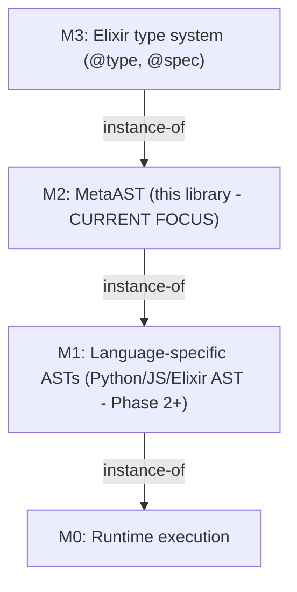

# WARP.md

This file provides guidance to WARP (warp.dev) when working with code in this repository.

## Project Overview

Metastatic is a cross-language code analysis library using a unified MetaAST (Meta-level Abstract Syntax Tree) representation. The core vision is: **Build tools once, apply them everywhere** - write mutation operators, purity analyzers, or complexity metrics in Elixir and have them work seamlessly across Python, JavaScript, Elixir, Ruby, Go, Rust, and more.

**Current Status:** Phase 9 Complete - Uniform 3-Tuple MetaAST Format (v0.3.0-dev)  
- Core MetaAST foundation implemented with 1422 passing tests (235 doctests + 1187 tests, 100% coverage)
- **New Uniform 3-Tuple Format**: All MetaAST nodes use `{type_atom, keyword_meta, children_or_value}`
- M2.2s Structural/Organizational Layer: container, function_def, attribute_access, augmented_assignment, property
- M1 Metadata Preservation: Full context threading (module, function, arity, visibility) for Ragex integration
- Language adapters: Python, Elixir, Ruby, Erlang, and Haskell fully implemented with 3-tuple output
- All 9 analysis tools support structural types and new 3-tuple format
- Business Logic Analyzers: 20 language-agnostic analyzers updated for 3-tuple format

## Essential Commands

### Testing
```bash
# Run all tests (1422 tests: 235 doctests + 1187 tests, all passing)
mix test

# Run specific test file
mix test test/metastatic/ast_test.exs

# Run tests with verbose output
mix test --trace

# Run with coverage
mix test --cover
```

### Development
```bash
# Install dependencies
mix deps.get

# Format code (ALWAYS run before commits per project conventions)
mix format

# Generate documentation
mix docs

# Check if code is formatted
mix format --check-formatted
```

### Running a Single Test
```bash
# Run a single test by line number
mix test test/metastatic/validator_test.exs:45

# Run all tests in a describe block by the line where "describe" starts
mix test test/metastatic/ast_test.exs:8
```

## Architecture

## Meta-Modeling Hierarchy (MOF-based)
Metastatic follows a four-level meta-modeling hierarchy:



**M2** is the meta-model that defines what AST nodes CAN be. All language-specific ASTs (M1) are instances that conform to M2.

### Three-Layer MetaAST (within M2)

**M2.1 Core Layer** - Universal concepts present in ALL languages
- Types: `literal`, `variable`, `binary_op`, `unary_op`, `function_call`, `conditional`, `early_return`, `block`, `list`, `map`
- Always normalized to common representation
- Examples: arithmetic operations, comparisons, function calls, lists, maps/dictionaries

**M2.2 Extended Layer** - Common patterns present in MOST languages  
- Types: `loop`, `lambda`, `collection_op`, `pattern_match`, `exception_handling`, `async_operation`
- Normalized with hints to preserve language-specific nuances
- Examples: loops (while/for), map/filter/reduce operations

**M2.2s Structural/Organizational Layer** - Top-level constructs for modules and classes
- Types: `container`, `function_def`, `param`, `attribute_access`, `augmented_assignment`, `property`
- Enables cross-language structural analysis and architectural transformations
- Examples: modules, classes, function definitions, method signatures, function parameters

**M2.3 Native Layer** - Language-specific escape hatches
- Type: `language_specific` (embeds M1 directly when needed)
- Preserved as-is for language-unique features
- Examples: Rust lifetimes, Python async/await specifics, Elixir macros

### Core Modules

**lib/metastatic/ast.ex** (551 lines)
- M2 meta-model type definitions
- Structural conformance checking (`conforms?/1`)
- Variable extraction (`variables/1`)
- Core type system for all MetaAST nodes

**lib/metastatic/document.ex** (197 lines)
- Wraps MetaAST with metadata and language info
- Stores original source for debugging/comparison
- Metadata preserves M1-specific information for round-trip fidelity

**lib/metastatic/adapter.ex** (422 lines)
- Behaviour specification for language adapters
- Defines M1 ↔ M2 transformation interface:
  - `parse/1`: Source → M1 (native AST)
  - `to_meta/1`: M1 → M2 (abstraction)
  - `from_meta/2`: M2 → M1 (reification)
  - `unparse/1`: M1 → Source
- Helper functions: `round_trip/2`, `abstract/3`, `reify/2`
- Adapters: Python, Elixir, Ruby, Erlang, Haskell all fully implemented

**lib/metastatic/builder.ex** (278 lines)
- High-level API for users
- `from_source/2`: Parse source to MetaAST (Source → M1 → M2)
- `to_source/1`: Convert MetaAST to source (M2 → M1 → Source)
- `round_trip/2`: Full pipeline for testing adapter fidelity

**lib/metastatic/validator.ex** (333 lines)
- Formal M1 → M2 conformance validation
- Three modes: `:strict` (no native), `:standard` (native with warnings), `:permissive` (all allowed)
- Returns validation metadata: level, depth, variable count, warnings
- Used to ensure AST structures conform to M2 meta-model

**lib/metastatic/application.ex**
- OTP application entry point
- Currently minimal supervisor structure

### M1 Metadata Preservation

The library now preserves M1 (language-specific) context information through the M2 abstraction layer, enabling tools like Ragex to access function names, modules, arities, and locations from business logic analyzers.

**Location Type Extension:**
```elixir
@type location :: %{
  optional(:line) => non_neg_integer(),
  optional(:column) => non_neg_integer(),
  optional(:path) => String.t(),
  # M1 context fields for Ragex integration
  optional(:language) => atom(),
  optional(:module) => String.t(),
  optional(:function) => String.t(),
  optional(:arity) => non_neg_integer(),
  optional(:container) => String.t(),
  optional(:visibility) => :public | :private | :protected,
  optional(:file) => String.t(),
  optional(:m1_meta) => map()
}
```

**Context Attachment Strategy:**
- **Container nodes** (modules/classes) receive `:module`, `:language`, `:line` metadata
- **Function_def nodes** receive `:function`, `:arity`, `:visibility`, `:language`, `:line` metadata
- **Child nodes** do NOT receive context enrichment (prevents tuple bloat)
- **Runner** extracts context from structural nodes and propagates via `context` map to analyzers

**Helper Functions:**
```elixir
# Attach context to a node
AST.with_context(node, %{module: "MyApp", function: "create", arity: 2})

# Extract specific metadata
AST.extract_metadata(node, :module)        # => "MyApp"
AST.extract_metadata(node, :function)      # => "create"

# Convenience extractors
AST.node_module(node)      # => "MyApp"
AST.node_function(node)    # => "create"
AST.node_arity(node)       # => 2
AST.node_visibility(node)  # => :public
```

**Example - Elixir Adapter (New 3-Tuple Format):**
```elixir
# Source
defmodule MyApp.UserController do
  def create(name, email) do
    {:ok, user} = User.create(name, email)
    user
  end
end

# MetaAST with uniform 3-tuple format
{:container, 
  [container_type: :module, name: "MyApp.UserController", module: "MyApp.UserController", 
   language: :elixir, line: 1],
  [{:function_def, 
    [name: "create", params: [...], visibility: :public, arity: 2, 
     function: "create", language: :elixir, line: 2],
    [body_statements...]}]}
```

**Integration with Analysis:**
- `Analyzer.issue/1` helper automatically extracts location metadata from nodes
- All 20 business logic analyzers benefit from context without modification
- Runner's `update_contexts/2` propagates structural node context to analyzer `context` map
- Analyzers access via `context.module_name` and `context.function_name`

### OpKind Semantic Metadata

The library provides semantic metadata for function calls through the `OpKind` system, enabling analyzers to reason about operations at a higher semantic level than raw syntax.

**OpKind Structure:**
An OpKind is a keyword list with the following fields:
- `:domain` - The operation domain (required): `:db`, `:http`, `:auth`, `:cache`, `:queue`, `:file`, `:external_api`
- `:operation` - The specific operation type (required): e.g., `:retrieve`, `:create`, `:query` for DB domain
- `:target` - The entity/resource being operated on (optional): e.g., "User", "Post"
- `:async` - Whether this is an async operation (optional, default: false)
- `:framework` - The framework/library this pattern comes from (optional): e.g., `:ecto`, `:django`, `:sequelize`

**Example - Database Operation:**
```elixir
# Elixir/Ecto: Repo.get(User, 1)
{:function_call, [
  name: "Repo.get",
  line: 42,
  op_kind: [domain: :db, operation: :retrieve, target: "User", framework: :ecto]
], [args...]}
```

**Analyzer Usage Pattern (Semantic-First, Heuristic-Fallback):**
```elixir
def analyze({:function_call, meta, _args} = node, context) when is_list(meta) do
  op_kind = Keyword.get(meta, :op_kind)
  
  is_db_operation? =
    case op_kind do
      # Semantic detection: op_kind metadata present (accurate)
      op_kind when is_list(op_kind) ->
        OpKind.db?(op_kind)
      
      # Fallback to heuristic detection (may have false positives)
      nil ->
        func_name = Keyword.get(meta, :name, "")
        database_function?(func_name)  # Pattern matching on name
    end
  
  if is_db_operation? do
    # Issue warning
  end
end
```

**Analyzers Using OpKind:**
- `BlockingInPlug`: Checks OpKind domain for blocking operations
- `MissingTelemetryForExternalHttp`: Uses `OpKind.http?()` for HTTP detection
- `SyncOverAsync`: Identifies blocking operations via OpKind domain
- `InefficientFilter`: Detects fetch-all operations via OpKind
- `TOCTOU`: Identifies file check/use operations via OpKind
- `MissingPreload`: Detects database collection queries
- `NPlusOneQuery`: Identifies database operations in loops

**Helper Functions:**
```elixir
# Check operation domain
OpKind.db?(op_kind)           # => true if domain is :db
OpKind.http?(op_kind)         # => true if domain is :http
OpKind.file?(op_kind)         # => true if domain is :file

# Extract fields
OpKind.domain(op_kind)        # => :db
OpKind.operation(op_kind)     # => :retrieve
OpKind.target(op_kind)        # => "User"

# Check operation type
OpKind.read?(op_kind)         # => true for :retrieve, :retrieve_all, :query
OpKind.write?(op_kind)        # => true for :create, :update, :delete
```

### Type System Key Decisions

**Uniform 3-Tuple Format (NEW):**
All MetaAST nodes now use a uniform structure: `{type_atom, keyword_meta, children_or_value}`
- `type_atom` - Node type (e.g., `:literal`, `:binary_op`, `:function_def`)
- `keyword_meta` - Keyword list with metadata (line, subtype, operator, etc.)
- `children_or_value` - Value for leaf nodes, list of children for composite nodes

**Examples:**
```elixir
{:literal, [subtype: :integer], 42}
{:variable, [line: 1], "x"}
{:binary_op, [category: :arithmetic, operator: :+], [left, right]}
{:function_call, [name: "Repo.all"], [args...]}
{:collection_op, [op_type: :map], [lambda, collection]}
{:function_def, [name: "create", params: [...], visibility: :public], [body...]}
{:param, [pattern: nil, default: nil], "name"}  # Function parameter
{:param, [pattern: nil, default: {:literal, [subtype: :integer], 0}], "count"}  # With default
```

**Critical naming:**
- The main type is `meta_ast()` (NOT `node()` - that conflicts with Elixir built-ins)
- Always use `meta_ast()` in type specs

**Binary operators categorized by semantics:**
- `:arithmetic` - `+`, `-`, `*`, `/`, etc.
- `:comparison` - `>`, `<`, `==`, `!=`, etc.
- `:boolean` - `and`, `or`, etc.

**Metadata in keyword lists:**
- Loop type: `{:loop, [loop_type: :while], [condition, body]}`
- Collection ops: `{:collection_op, [op_type: :map], [lambda, collection]}`
- Exception handling: `{:exception_handling, [], [try_block, match_arm1, ...]}`

**Wildcard pattern:**
- Pattern matching supports `:_` as catch-all

## Development Workflow

### Phase Context
Phase 9 (Uniform 3-Tuple Format) is **complete**. Current state:
- All MetaAST nodes migrated to uniform 3-tuple format: `{type_atom, keyword_meta, children_or_value}`
- Core MetaAST types (M2.1 Core + M2.2 Extended + M2.2s Structural) fully implemented and tested
- All 5 language adapters operational with 3-tuple output: Python, Elixir, Ruby, Erlang, Haskell
- Full structural support: containers, function definitions, properties
- All 9 analysis tools updated for 3-tuple format
- 20 business logic analyzers updated for 3-tuple format

### Working with MetaAST

```elixir
alias Metastatic.{AST, Document, Validator, Builder}

# Create MetaAST manually using new 3-tuple format
ast = {:binary_op, [category: :arithmetic, operator: :+], 
  [{:variable, [], "x"}, {:literal, [subtype: :integer], 5}]}

# Validate conformance
AST.conforms?(ast)  # => true

# Extract variables
AST.variables(ast)  # => MapSet.new(["x"])

# Wrap in document
doc = Document.new(ast, :python)

# Full validation with metadata
{:ok, meta} = Validator.validate(doc)
meta.level        # => :core
meta.depth        # => 2
meta.node_count   # => 3
meta.variables    # => MapSet.new(["x"])
```

### Code Style Requirements

- **Formatting:** ALWAYS run `mix format` before commits (per project conventions)
- **Documentation:** All public functions MUST have `@doc` with examples
- **Type specs:** All public functions MUST have `@spec`
- **Tests:** Aim for >90% coverage (currently 100%)
- **Naming:** Descriptive names, avoid abbreviations
- **Pattern matching in tests:** For short lists (≤5 elements), prefer `assert [_, _, _] = list` over `assert length(list) == 3`

### Test Organization

Tests use ExUnit with doctests enabled. Structure:
```elixir
defmodule Metastatic.SomeModuleTest do
  use ExUnit.Case, async: true
  
  alias Metastatic.SomeModule
  
  doctest Metastatic.SomeModule
  
  describe "feature group" do
    test "specific behavior" do
      # arrange, act, assert
    end
  end
end
```

### Adding New Features

When extending the meta-model:
1. Update type definitions in `ast.ex`
2. Add conformance checks to `AST.conforms?/1`
3. Update `Validator` to handle new constructs
4. Add comprehensive tests (targeting 100% coverage)
5. Document with examples in `@doc`
6. Run `mix format` before committing

## Documentation Structure

**For Users:**
- **README.md** - High-level overview, quick start, current status
- **GETTING_STARTED.md** - Developer onboarding, setup, common tasks

**For Theory:**
- **RESEARCH.md** - Architecture analysis, design decisions (826 lines)
- **THEORETICAL_FOUNDATIONS.md** - Formal meta-modeling theory with proofs (953 lines)

**For Planning:**
- **IMPLEMENTATION_PLAN.md** - Detailed 14-month roadmap across 5 phases
- **STATUS.md** - Current completion status, metrics, what works now
- **CHANGELOG.md** - Version history

**Generate API docs:**
```bash
mix docs
# Open doc/index.html in browser
```

## Semantic Equivalence Principle

**Core concept:** Different M1 models (language ASTs) can be instances of the same M2 meta-type.

Example - all three represent the same M2 concept:
```
M2 (meta-level, new 3-tuple format):
  {:binary_op, [category: :arithmetic, operator: :+], 
    [{:variable, [], "x"}, {:literal, [subtype: :integer], 5}]}

M1 instances (language-specific):
  Python:     BinOp(op=Add(), left=Name('x'), right=Num(5))
  JavaScript: BinaryExpression(operator: '+', left: Identifier('x'), right: Literal(5))
  Elixir:     {:+, [], [{:x, [], nil}, 5]}
```

This enables universal transformations - mutations at M2 level apply to all languages.

## Testing Philosophy

Tests are organized by M2 layer:
- **M2.1 Core** tests: Universal constructs (literals, variables, operators, conditionals)
- **M2.2 Extended** tests: Common patterns (loops, lambdas, collections, pattern matching)
- **M2.3 Native** tests: Language-specific escape hatches

All tests use meaningful examples demonstrating real-world usage, not just synthetic cases.

## Future Work Context

When implementing language adapters (Phase 2+):
1. Create module in `lib/metastatic/adapters/`
2. Implement `@behaviour Metastatic.Adapter`
3. Required callbacks: `parse/1`, `to_meta/1`, `from_meta/2`, `unparse/1`, `file_extensions/0`
4. Target >95% round-trip fidelity (Source → M1 → M2 → M1 → Source)
5. Create 50+ test fixtures
6. Aim for <100ms performance per 1000 LOC

When implementing cross-language tools (Phase 3+):
- Mutation operators work at M2 level, apply to all languages
- Purity analysis uses M2 AST traversal
- All tools language-agnostic by design
