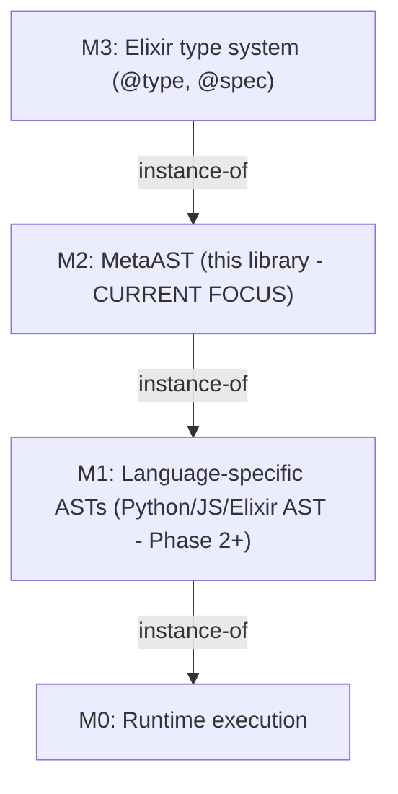

# WARP.md

This file provides guidance to WARP (warp.dev) when working with code in this repository.

## Project Overview

Metastatic is a cross-language code analysis library using a unified MetaAST (Meta-level Abstract Syntax Tree) representation. The core vision is: **Build tools once, apply them everywhere** - write mutation operators, purity analyzers, or complexity metrics in Elixir and have them work seamlessly across Python, JavaScript, Elixir, Ruby, Go, Rust, and more.

**Current Status:** Phase 1 Complete (v0.1.0-dev)  
- Core MetaAST foundation implemented with 1356 passing tests (100% coverage)
- Language adapters: Python and Elixir implemented and fully tested
- Additional language adapters (JavaScript, Ruby, etc.) coming in Phase 2+

## Essential Commands

### Testing
```bash
# Run all tests (1356 tests: 131 doctests + 1225 tests, all passing)
mix test

# Run specific test file
mix test test/metastatic/ast_test.exs

# Run tests with verbose output
mix test --trace

# Run with coverage
mix test --cover
```

### Development
```bash
# Install dependencies
mix deps.get

# Format code (ALWAYS run before commits per project conventions)
mix format

# Generate documentation
mix docs

# Check if code is formatted
mix format --check-formatted
```

### Running a Single Test
```bash
# Run a single test by line number
mix test test/metastatic/validator_test.exs:45

# Run all tests in a describe block by the line where "describe" starts
mix test test/metastatic/ast_test.exs:8
```

## Architecture

## Meta-Modeling Hierarchy (MOF-based)
Metastatic follows a four-level meta-modeling hierarchy:



**M2** is the meta-model that defines what AST nodes CAN be. All language-specific ASTs (M1) are instances that conform to M2.

### Three-Layer MetaAST (within M2)

**M2.1 Core Layer** - Universal concepts present in ALL languages
- Types: `literal`, `variable`, `binary_op`, `unary_op`, `function_call`, `conditional`, `early_return`, `block`, `list`, `map`
- Always normalized to common representation
- Examples: arithmetic operations, comparisons, function calls, lists, maps/dictionaries

**M2.2 Extended Layer** - Common patterns present in MOST languages  
- Types: `loop`, `lambda`, `collection_op`, `pattern_match`, `exception_handling`, `async_operation`
- Normalized with hints to preserve language-specific nuances
- Examples: loops (while/for), map/filter/reduce operations

**M2.3 Native Layer** - Language-specific escape hatches
- Type: `language_specific` (embeds M1 directly when needed)
- Preserved as-is for language-unique features
- Examples: Rust lifetimes, Python async/await specifics, Elixir macros

### Core Modules

**lib/metastatic/ast.ex** (551 lines)
- M2 meta-model type definitions
- Structural conformance checking (`conforms?/1`)
- Variable extraction (`variables/1`)
- Core type system for all MetaAST nodes

**lib/metastatic/document.ex** (197 lines)
- Wraps MetaAST with metadata and language info
- Stores original source for debugging/comparison
- Metadata preserves M1-specific information for round-trip fidelity

**lib/metastatic/adapter.ex** (422 lines)
- Behaviour specification for language adapters
- Defines M1 ↔ M2 transformation interface:
  - `parse/1`: Source → M1 (native AST)
  - `to_meta/1`: M1 → M2 (abstraction)
  - `from_meta/2`: M2 → M1 (reification)
  - `unparse/1`: M1 → Source
- Helper functions: `round_trip/2`, `abstract/3`, `reify/2`
- Note: No adapters implemented yet (Phase 2+)

**lib/metastatic/builder.ex** (278 lines)
- High-level API for users
- `from_source/2`: Parse source to MetaAST (Source → M1 → M2)
- `to_source/1`: Convert MetaAST to source (M2 → M1 → Source)
- `round_trip/2`: Full pipeline for testing adapter fidelity

**lib/metastatic/validator.ex** (333 lines)
- Formal M1 → M2 conformance validation
- Three modes: `:strict` (no native), `:standard` (native with warnings), `:permissive` (all allowed)
- Returns validation metadata: level, depth, variable count, warnings
- Used to ensure AST structures conform to M2 meta-model

**lib/metastatic/application.ex**
- OTP application entry point
- Currently minimal supervisor structure

### Type System Key Decisions

**Critical naming:**
- The main type is `meta_ast()` (NOT `node()` - that conflicts with Elixir built-ins)
- Always use `meta_ast()` in type specs

**Binary operators categorized by semantics:**
- `:arithmetic` - `+`, `-`, `*`, `/`, etc.
- `:comparison` - `>`, `<`, `==`, `!=`, etc.
- `:boolean` - `and`, `or`, etc.

**Loop type variations:**
- `:while` loops: `{:loop, :while, condition, body}` (4-tuple)
- `:for`/`:for_each` loops: `{:loop, :for, iterator, collection, body}` (5-tuple)

**Collection operations:**
- Map/filter: `{:collection_op, :map, fn, collection}` (4-tuple)
- Reduce: `{:collection_op, :reduce, fn, collection, initial}` (5-tuple)

**Wildcard pattern:**
- Pattern matching supports `:_` as catch-all

## Development Workflow

### Phase Context
Phase 1 (Core Foundation) is **complete**. All work going forward should understand:
- Core MetaAST types are stable and fully tested
- Language adapters don't exist yet (coming in Phase 2: Python, then Phase 3: JavaScript/Elixir)
- Mutation engine and purity analyzer are planned for Phase 3

### Working with MetaAST

```elixir
alias Metastatic.{AST, Document, Validator, Builder}

# Create MetaAST manually (current capability)
ast = {:binary_op, :arithmetic, :+, {:variable, "x"}, {:literal, :integer, 5}}

# Validate conformance
AST.conforms?(ast)  # => true

# Extract variables
AST.variables(ast)  # => MapSet.new(["x"])

# Wrap in document
doc = Document.new(ast, :python)

# Full validation with metadata
{:ok, meta} = Validator.validate(doc)
meta.level        # => :core
meta.depth        # => 2
meta.node_count   # => 3
meta.variables    # => MapSet.new(["x"])
```

### Code Style Requirements

- **Formatting:** ALWAYS run `mix format` before commits (per project conventions)
- **Documentation:** All public functions MUST have `@doc` with examples
- **Type specs:** All public functions MUST have `@spec`
- **Tests:** Aim for >90% coverage (currently 100%)
- **Naming:** Descriptive names, avoid abbreviations
- **Pattern matching in tests:** For short lists (≤5 elements), prefer `assert [_, _, _] = list` over `assert length(list) == 3`

### Test Organization

Tests use ExUnit with doctests enabled. Structure:
```elixir
defmodule Metastatic.SomeModuleTest do
  use ExUnit.Case, async: true
  
  alias Metastatic.SomeModule
  
  doctest Metastatic.SomeModule
  
  describe "feature group" do
    test "specific behavior" do
      # arrange, act, assert
    end
  end
end
```

### Adding New Features

When extending the meta-model:
1. Update type definitions in `ast.ex`
2. Add conformance checks to `AST.conforms?/1`
3. Update `Validator` to handle new constructs
4. Add comprehensive tests (targeting 100% coverage)
5. Document with examples in `@doc`
6. Run `mix format` before committing

## Documentation Structure

**For Users:**
- **README.md** - High-level overview, quick start, current status
- **GETTING_STARTED.md** - Developer onboarding, setup, common tasks

**For Theory:**
- **RESEARCH.md** - Architecture analysis, design decisions (826 lines)
- **THEORETICAL_FOUNDATIONS.md** - Formal meta-modeling theory with proofs (953 lines)

**For Planning:**
- **IMPLEMENTATION_PLAN.md** - Detailed 14-month roadmap across 5 phases
- **STATUS.md** - Current completion status, metrics, what works now
- **CHANGELOG.md** - Version history

**Generate API docs:**
```bash
mix docs
# Open doc/index.html in browser
```

## Semantic Equivalence Principle

**Core concept:** Different M1 models (language ASTs) can be instances of the same M2 meta-type.

Example - all three represent the same M2 concept:
```
M2 (meta-level):
  {:binary_op, :arithmetic, :+, {:variable, "x"}, {:literal, :integer, 5}}

M1 instances (language-specific):
  Python:     BinOp(op=Add(), left=Name('x'), right=Num(5))
  JavaScript: BinaryExpression(operator: '+', left: Identifier('x'), right: Literal(5))
  Elixir:     {:+, [], [{:x, [], nil}, 5]}
```

This enables universal transformations - mutations at M2 level apply to all languages.

## Testing Philosophy

Tests are organized by M2 layer:
- **M2.1 Core** tests: Universal constructs (literals, variables, operators, conditionals)
- **M2.2 Extended** tests: Common patterns (loops, lambdas, collections, pattern matching)
- **M2.3 Native** tests: Language-specific escape hatches

All tests use meaningful examples demonstrating real-world usage, not just synthetic cases.

## Future Work Context

When implementing language adapters (Phase 2+):
1. Create module in `lib/metastatic/adapters/`
2. Implement `@behaviour Metastatic.Adapter`
3. Required callbacks: `parse/1`, `to_meta/1`, `from_meta/2`, `unparse/1`, `file_extensions/0`
4. Target >95% round-trip fidelity (Source → M1 → M2 → M1 → Source)
5. Create 50+ test fixtures
6. Aim for <100ms performance per 1000 LOC

When implementing cross-language tools (Phase 3+):
- Mutation operators work at M2 level, apply to all languages
- Purity analysis uses M2 AST traversal
- All tools language-agnostic by design
