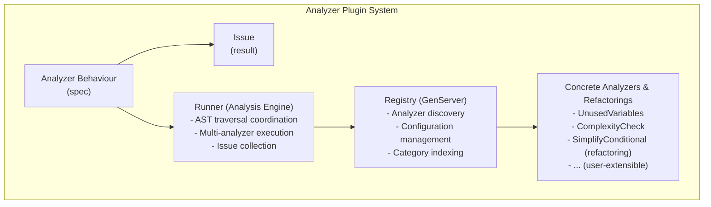
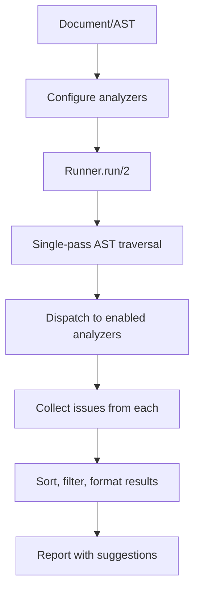

# Analyzer and Refactoring Plugin Architecture

## Overview

This document describes the plugin-like architecture for extensible analyzers and refactoring suggestions in Metastatic, inspired by Credo's design. The system allows users to attach custom analyzers and refactoring suggestions while Metastatic handles MetaAST traversal and analysis coordination.

## Design Goals

1. **Extensibility** - Users can create custom analyzers without modifying core library
2. **Composition** - Multiple analyzers can run on the same AST efficiently
3. **Separation of Concerns** - Core library handles traversal, plugins handle analysis logic
4. **Configuration** - Enable/disable analyzers, set thresholds, configure behavior
5. **Reporting** - Unified issue reporting with severity, location, suggestions
6. **Performance** - Single-pass traversal for multiple analyzers when possible

## Architecture

### Components



### Data Flow



## Core API

### Analyzer Behaviour

Defines the contract for all analyzers (both diagnostic and refactoring):

```elixir
defmodule Metastatic.Analysis.Analyzer do
  @moduledoc """
  Behaviour for MetaAST analyzers and refactoring suggestions.
  
  Analyzers can be diagnostic (detecting issues) or prescriptive (suggesting
  improvements). Both types work uniformly through this behaviour.
  """
  
  @type category :: :readability | :maintainability | :performance | 
                    :security | :correctness | :style | :refactoring
  
  @type severity :: :error | :warning | :info | :refactoring_opportunity
  
  @type issue :: %{
    analyzer: module(),
    category: category(),
    severity: severity(),
    message: String.t(),
    node: Metastatic.AST.meta_ast(),
    location: location(),
    suggestion: suggestion() | nil,
    metadata: map()
  }
  
  @type location :: %{
    line: non_neg_integer() | nil,
    column: non_neg_integer() | nil,
    path: Path.t() | nil
  }
  
  @type suggestion :: %{
    type: :replace | :remove | :insert_before | :insert_after,
    replacement: Metastatic.AST.meta_ast() | nil,
    message: String.t()
  }
  
  @type context :: %{
    document: Metastatic.Document.t(),
    config: map(),
    parent_stack: [Metastatic.AST.meta_ast()],
    depth: non_neg_integer(),
    scope: map()
  }
  
  @doc """
  Returns metadata about this analyzer.
  """
  @callback info() :: %{
    name: atom(),
    category: category(),
    description: String.t(),
    severity: severity(),
    explanation: String.t(),
    configurable: boolean()
  }
  
  @doc """
  Analyzes a single AST node in context.
  
  Called once per node during traversal. Returns list of issues found.
  Return empty list if no issues.
  """
  @callback analyze(node :: Metastatic.AST.meta_ast(), context :: context()) :: 
    [issue()] | []
  
  @doc """
  Optional: Run once before traversal starts.
  
  Can be used for initial setup or whole-document analysis.
  """
  @callback run_before(context :: context()) :: {:ok, context()} | {:skip, reason :: term()}
  
  @doc """
  Optional: Run once after traversal completes.
  
  Can be used for final analysis or cross-node checks.
  """
  @callback run_after(context :: context(), issues :: [issue()]) :: [issue()]
  
  @optional_callbacks run_before: 1, run_after: 2
end
```

### Runner

Coordinates analyzer execution:

```elixir
defmodule Metastatic.Analysis.Runner do
  @moduledoc """
  Executes multiple analyzers on a Document in a single pass.
  
  Handles AST traversal, context management, and issue collection.
  """
  
  alias Metastatic.{Document, AST}
  alias Metastatic.Analysis.{Analyzer, Registry}
  
  @type run_options :: [
    analyzers: :all | [module()],
    config: map(),
    halt_on_error: boolean(),
    max_issues: non_neg_integer() | :infinity
  ]
  
  @doc """
  Runs configured analyzers on a document.
  
  ## Options
  
  - `:analyzers` - Which analyzers to run (default: `:all` registered)
  - `:config` - Configuration map for analyzers
  - `:halt_on_error` - Stop on first error severity issue (default: `false`)
  - `:max_issues` - Maximum issues to collect (default: `:infinity`)
  
  ## Examples
  
      iex> doc = Document.new(ast, :python)
      iex> {:ok, report} = Runner.run(doc)
      iex> length(report.issues)
      3
      
      iex> {:ok, report} = Runner.run(doc, analyzers: [UnusedVariables])
      iex> report.analyzers_run
      [Metastatic.Analysis.UnusedVariables]
  """
  @spec run(Document.t(), run_options()) :: {:ok, map()} | {:error, term()}
  def run(%Document{} = doc, opts \\\\ []) do
    # Get analyzers to run
    analyzers = get_analyzers(opts)
    config = Keyword.get(opts, :config, %{})
    
    # Initialize context
    base_context = %{
      document: doc,
      config: config,
      parent_stack: [],
      depth: 0,
      scope: %{}
    }
    
    # Run before hooks
    {ready_analyzers, contexts} = run_before_hooks(analyzers, base_context)
    
    # Traverse AST and collect issues
    issues = traverse(doc.ast, ready_analyzers, contexts, opts)
    
    # Run after hooks
    final_issues = run_after_hooks(ready_analyzers, contexts, issues)
    
    # Build report
    report = %{
      document: doc,
      analyzers_run: ready_analyzers,
      issues: final_issues,
      summary: summarize(final_issues),
      timing: nil  # TODO: Add timing info
    }
    
    {:ok, report}
  end
  
  @doc """
  Runs analyzers, raising on error.
  """
  @spec run!(Document.t(), run_options()) :: map()
  def run!(doc, opts \\\\ []) do
    case run(doc, opts) do
      {:ok, report} -> report
      {:error, reason} -> raise "Analysis failed: #{inspect(reason)}"
    end
  end
  
  # Private implementation
  
  defp get_analyzers(opts) do
    case Keyword.get(opts, :analyzers, :all) do
      :all -> Registry.list_all()
      list when is_list(list) -> list
    end
  end
  
  defp traverse(ast, analyzers, contexts, opts) do
    # Single-pass traversal calling all analyzers
    walk(ast, analyzers, contexts, [], opts)
  end
  
  defp walk(ast, analyzers, contexts, issues, opts) do
    # Update context for current depth/parent
    contexts = update_contexts(contexts, ast)
    
    # Call each analyzer on this node
    node_issues = 
      Enum.flat_map(analyzers, fn analyzer ->
        context = Map.get(contexts, analyzer)
        apply_analyzer(analyzer, ast, context)
      end)
    
    all_issues = issues ++ node_issues
    
    # Check halt conditions
    if should_halt?(all_issues, opts) do
      all_issues
    else
      # Recurse into children
      walk_children(ast, analyzers, contexts, all_issues, opts)
    end
  end
  
  defp walk_children(ast, analyzers, contexts, issues, opts) do
    # Traverse based on node structure
    children = extract_children(ast)
    
    Enum.reduce(children, issues, fn child, acc ->
      walk(child, analyzers, contexts, acc, opts)
    end)
  end
  
  defp extract_children(ast) do
    # Extract child nodes based on type
    # Similar to validator.ex walk_ast but collects children
    case ast do
      {:binary_op, _, _, left, right} -> [left, right]
      {:unary_op, _, _, operand} -> [operand]
      {:conditional, cond, then_br, else_br} -> [cond, then_br, else_br]
      {:block, stmts} when is_list(stmts) -> stmts
      {:loop, :while, cond, body} -> [cond, body]
      {:loop, _, iter, coll, body} -> [iter, coll, body]
      {:function_call, _, args} -> args
      {:lambda, _params, body} -> [body]
      {:collection_op, _, func, coll} -> [func, coll]
      {:collection_op, _, func, coll, init} -> [func, coll, init]
      _ -> []
    end
  end
  
  defp apply_analyzer(analyzer, ast, context) do
    try do
      analyzer.analyze(ast, context)
    rescue
      e ->
        # Log error but don't fail entire analysis
        require Logger
        Logger.error("Analyzer #{inspect(analyzer)} failed: #{inspect(e)}")
        []
    end
  end
  
  defp run_before_hooks(analyzers, base_context) do
    Enum.reduce(analyzers, {[], %{}}, fn analyzer, {ready, contexts} ->
      if function_exported?(analyzer, :run_before, 1) do
        case analyzer.run_before(base_context) do
          {:ok, ctx} -> {[analyzer | ready], Map.put(contexts, analyzer, ctx)}
          {:skip, _reason} -> {ready, contexts}
        end
      else
        {[analyzer | ready], Map.put(contexts, analyzer, base_context)}
      end
    end)
  end
  
  defp run_after_hooks(analyzers, contexts, issues) do
    Enum.reduce(analyzers, issues, fn analyzer, acc ->
      if function_exported?(analyzer, :run_after, 2) do
        context = Map.get(contexts, analyzer)
        analyzer.run_after(context, acc)
      else
        acc
      end
    end)
  end
  
  defp update_contexts(contexts, _ast) do
    # Update parent stack, depth, etc.
    # TODO: Implement context updates
    contexts
  end
  
  defp should_halt?(issues, opts) do
    halt_on_error = Keyword.get(opts, :halt_on_error, false)
    max_issues = Keyword.get(opts, :max_issues, :infinity)
    
    has_error = halt_on_error and Enum.any?(issues, fn i -> i.severity == :error end)
    over_max = max_issues != :infinity and length(issues) >= max_issues
    
    has_error or over_max
  end
  
  defp summarize(issues) do
    %{
      total: length(issues),
      by_severity: Enum.frequencies_by(issues, & &1.severity),
      by_category: Enum.frequencies_by(issues, & &1.category),
      by_analyzer: Enum.frequencies_by(issues, & &1.analyzer)
    }
  end
end
```

### Registry

Manages analyzer discovery and configuration:

```elixir
defmodule Metastatic.Analysis.Registry do
  @moduledoc """
  Registry for analyzer plugins.
  
  Manages registration, discovery, and configuration of analyzers.
  Similar to Metastatic.Supplemental.Registry but for analysis.
  """
  
  use GenServer
  
  @type registry_state :: %{
    by_name: %{atom() => module()},
    by_category: %{atom() => [module()]},
    all: MapSet.t(module()),
    config: map()
  }
  
  # Client API
  
  @doc "Starts the registry GenServer"
  @spec start_link(keyword()) :: GenServer.on_start()
  def start_link(opts \\\\ []) do
    GenServer.start_link(__MODULE__, opts, name: __MODULE__)
  end
  
  @doc "Registers an analyzer module"
  @spec register(module()) :: :ok | {:error, term()}
  def register(analyzer) do
    GenServer.call(__MODULE__, {:register, analyzer})
  end
  
  @doc "Unregisters an analyzer"
  @spec unregister(module()) :: :ok
  def unregister(analyzer) do
    GenServer.call(__MODULE__, {:unregister, analyzer})
  end
  
  @doc "Lists all registered analyzers"
  @spec list_all() :: [module()]
  def list_all do
    GenServer.call(__MODULE__, :list_all)
  end
  
  @doc "Lists analyzers by category"
  @spec list_by_category(atom()) :: [module()]
  def list_by_category(category) do
    GenServer.call(__MODULE__, {:list_by_category, category})
  end
  
  @doc "Gets analyzer by name"
  @spec get_by_name(atom()) :: module() | nil
  def get_by_name(name) do
    GenServer.call(__MODULE__, {:get_by_name, name})
  end
  
  @doc "Updates configuration for an analyzer"
  @spec configure(module(), map()) :: :ok
  def configure(analyzer, config) do
    GenServer.call(__MODULE__, {:configure, analyzer, config})
  end
  
  @doc "Gets configuration for an analyzer"
  @spec get_config(module()) :: map()
  def get_config(analyzer) do
    GenServer.call(__MODULE__, {:get_config, analyzer})
  end
  
  # Server Callbacks
  
  @impl true
  def init(_opts) do
    state = %{
      by_name: %{},
      by_category: %{},
      all: MapSet.new(),
      config: %{}
    }
    
    # Auto-register built-in analyzers
    auto_register_from_config()
    
    {:ok, state}
  end
  
  @impl true
  def handle_call({:register, analyzer}, _from, state) do
    case validate_and_register(analyzer, state) do
      {:ok, new_state} -> {:reply, :ok, new_state}
      {:error, reason} -> {:reply, {:error, reason}, state}
    end
  end
  
  # ... other callbacks similar to Supplemental.Registry
  
  # Private functions
  
  defp validate_and_register(analyzer, state) do
    with :ok <- validate_behaviour(analyzer),
         :ok <- validate_info(analyzer),
         :ok <- validate_no_conflicts(analyzer, state) do
      {:ok, do_register(analyzer, state)}
    end
  end
  
  defp validate_behaviour(analyzer) do
    if function_exported?(analyzer, :info, 0) and 
       function_exported?(analyzer, :analyze, 2) do
      :ok
    else
      {:error, "Module #{inspect(analyzer)} does not implement Analyzer behaviour"}
    end
  end
  
  defp validate_info(analyzer) do
    info = analyzer.info()
    
    required_keys = [:name, :category, :description, :severity]
    if Enum.all?(required_keys, &Map.has_key?(info, &1)) do
      :ok
    else
      {:error, "Module #{inspect(analyzer)} has invalid info"}
    end
  end
  
  defp validate_no_conflicts(analyzer, state) do
    info = analyzer.info()
    
    case Map.get(state.by_name, info.name) do
      nil -> :ok
      existing -> {:error, "Analyzer named #{info.name} already registered: #{inspect(existing)}"}
    end
  end
  
  defp do_register(analyzer, state) do
    info = analyzer.info()
    
    by_name = Map.put(state.by_name, info.name, analyzer)
    
    by_category = 
      Map.update(state.by_category, info.category, [analyzer], fn list ->
        [analyzer | list] |> Enum.uniq()
      end)
    
    all = MapSet.put(state.all, analyzer)
    
    %{state | by_name: by_name, by_category: by_category, all: all}
  end
  
  defp auto_register_from_config do
    config = Application.get_env(:metastatic, :analyzers, [])
    auto_register = Keyword.get(config, :auto_register, [])
    
    Enum.each(auto_register, fn analyzer ->
      case register(analyzer) do
        :ok -> :ok
        {:error, _} -> :ok  # Ignore errors during auto-registration
      end
    end)
  end
end
```

## Example Analyzers

### Diagnostic Analyzer

```elixir
defmodule Metastatic.Analysis.UnusedVariables do
  @behaviour Metastatic.Analysis.Analyzer
  
  alias Metastatic.{AST, Analysis.Analyzer}
  
  @impl true
  def info do
    %{
      name: :unused_variables,
      category: :correctness,
      description: "Detects variables that are assigned but never used",
      severity: :warning,
      explanation: """
      Variables that are assigned but never referenced add noise and
      may indicate bugs or incomplete code.
      """,
      configurable: true
    }
  end
  
  @impl true
  def run_before(context) do
    # Initialize tracking state
    context = Map.put(context, :assigned, %{})
    context = Map.put(context, :used, MapSet.new())
    {:ok, context}
  end
  
  @impl true
  def analyze({:assignment, {:variable, name}, _value}, context) do
    # Track assignment
    context = update_in(context, [:assigned], &Map.put(&1, name, true))
    []
  end
  
  def analyze({:variable, name}, context) do
    # Track usage
    context = update_in(context, [:used], &MapSet.put(&1, name))
    []
  end
  
  def analyze(_node, _context), do: []
  
  @impl true
  def run_after(context, _issues) do
    # Find assigned but not used
    assigned = Map.keys(context.assigned)
    used = context.used
    
    unused = Enum.filter(assigned, fn var -> not MapSet.member?(used, var) end)
    
    Enum.map(unused, fn var ->
      %{
        analyzer: __MODULE__,
        category: :correctness,
        severity: :warning,
        message: "Variable '#{var}' is assigned but never used",
        node: {:variable, var},
        location: %{line: nil, column: nil, path: nil},
        suggestion: %{
          type: :remove,
          replacement: nil,
          message: "Consider removing this unused variable"
        },
        metadata: %{variable: var}
      }
    end)
  end
end
```

### Refactoring Analyzer

```elixir
defmodule Metastatic.Analysis.SimplifyConditional do
  @behaviour Metastatic.Analysis.Analyzer
  
  alias Metastatic.Analysis.Analyzer
  
  @impl true
  def info do
    %{
      name: :simplify_conditional,
      category: :refactoring,
      description: "Suggests simplification of redundant conditionals",
      severity: :refactoring_opportunity,
      explanation: """
      Conditionals that return boolean literals can often be simplified
      to direct boolean expressions.
      """,
      configurable: false
    }
  end
  
  @impl true
  def analyze({:conditional, condition, 
                {:literal, :boolean, true},
                {:literal, :boolean, false}}, _context) do
    # Pattern: if condition then true else false => condition
    [
      %{
        analyzer: __MODULE__,
        category: :refactoring,
        severity: :refactoring_opportunity,
        message: "This conditional can be simplified to just the condition",
        node: {:conditional, condition, 
                {:literal, :boolean, true},
                {:literal, :boolean, false}},
        location: %{line: nil, column: nil, path: nil},
        suggestion: %{
          type: :replace,
          replacement: condition,
          message: "Replace with: #{format_ast(condition)}"
        },
        metadata: %{}
      }
    ]
  end
  
  def analyze({:conditional, condition,
                {:literal, :boolean, false},
                {:literal, :boolean, true}}, _context) do
    # Pattern: if condition then false else true => not condition
    [
      %{
        analyzer: __MODULE__,
        category: :refactoring,
        severity: :refactoring_opportunity,
        message: "This conditional can be simplified to the negation",
        node: {:conditional, condition,
                {:literal, :boolean, false},
                {:literal, :boolean, true}},
        location: %{line: nil, column: nil, path: nil},
        suggestion: %{
          type: :replace,
          replacement: {:unary_op, :boolean, :not, condition},
          message: "Replace with: not #{format_ast(condition)}"
        },
        metadata: %{}
      }
    ]
  end
  
  def analyze(_node, _context), do: []
  
  defp format_ast({:variable, name}), do: name
  defp format_ast(ast), do: inspect(ast)
end
```

## Configuration

Users configure analyzers via application config or runtime options:

```elixir
# config/config.exs
config :metastatic, :analyzers,
  auto_register: [
    Metastatic.Analysis.UnusedVariables,
    Metastatic.Analysis.Complexity,
    Metastatic.Analysis.SimplifyConditional
  ],
  disabled: [:complexity],  # Disable specific analyzers
  config: %{
    unused_variables: %{
      ignore_prefix: "_"  # Ignore vars starting with _
    },
    complexity: %{
      max_cyclomatic: 10,
      max_cognitive: 15
    }
  }

# Runtime usage
alias Metastatic.{Document, Analysis.Runner}

doc = Document.new(ast, :python)

# Run all registered analyzers
{:ok, report} = Runner.run(doc)

# Run specific analyzers
{:ok, report} = Runner.run(doc, 
  analyzers: [UnusedVariables, SimplifyConditional]
)

# With custom config
{:ok, report} = Runner.run(doc,
  analyzers: :all,
  config: %{
    unused_variables: %{ignore_prefix: "tmp_"}
  }
)
```

## Integration with Existing Analysis Modules

Existing analysis modules (Purity, Complexity, etc.) can be wrapped as analyzers:

```elixir
defmodule Metastatic.Analysis.PurityAnalyzer do
  @behaviour Metastatic.Analysis.Analyzer
  
  alias Metastatic.Analysis.Purity
  
  @impl true
  def info do
    %{
      name: :purity,
      category: :maintainability,
      description: "Detects impure functions (with side effects)",
      severity: :info,
      explanation: "Functions with side effects are harder to test and reason about",
      configurable: false
    }
  end
  
  @impl true
  def run_before(context) do
    # Run full purity analysis once
    {:ok, purity_result} = Purity.analyze(context.document)
    context = Map.put(context, :purity_result, purity_result)
    {:ok, context}
  end
  
  @impl true
  def analyze(_node, _context), do: []  # Analysis done in run_before
  
  @impl true
  def run_after(context, _issues) do
    purity = context.purity_result
    
    if not purity.pure? do
      [
        %{
          analyzer: __MODULE__,
          category: :maintainability,
          severity: :info,
          message: "Function has side effects: #{Enum.join(purity.effects, ", ")}",
          node: context.document.ast,
          location: %{line: nil, column: nil, path: nil},
          suggestion: nil,
          metadata: %{effects: purity.effects}
        }
      ]
    else
      []
    end
  end
end
```

## Usage Patterns

### Running Analysis

```elixir
# Simple analysis
{:ok, report} = Runner.run(doc)

IO.puts("Found #{report.summary.total} issues")
Enum.each(report.issues, fn issue ->
  IO.puts("[#{issue.severity}] #{issue.message}")
end)

# Filter by severity
errors = Enum.filter(report.issues, &(&1.severity == :error))

# Group by analyzer
by_analyzer = Enum.group_by(report.issues, & &1.analyzer)

# Get refactoring suggestions
refactorings = 
  report.issues
  |> Enum.filter(&(&1.severity == :refactoring_opportunity))
  |> Enum.filter(&(&1.suggestion != nil))
```

### Custom Analyzer

```elixir
defmodule MyApp.Analyzers.NoMagicNumbers do
  @behaviour Metastatic.Analysis.Analyzer
  
  @impl true
  def info do
    %{
      name: :no_magic_numbers,
      category: :style,
      description: "Flags magic numbers (literals used without explanation)",
      severity: :warning,
      explanation: "Use named constants instead of magic numbers",
      configurable: true
    }
  end
  
  @impl true
  def analyze({:literal, :integer, value}, context) 
      when value not in [0, 1] do
    # Flag integers other than 0 or 1
    [
      %{
        analyzer: __MODULE__,
        category: :style,
        severity: :warning,
        message: "Magic number #{value} should be a named constant",
        node: {:literal, :integer, value},
        location: %{line: nil, column: nil, path: nil},
        suggestion: %{
          type: :replace,
          replacement: {:variable, "CONSTANT_NAME"},
          message: "Extract to a named constant"
        },
        metadata: %{value: value}
      }
    ]
  end
  
  def analyze(_node, _context), do: []
end

# Register and use
alias Metastatic.Analysis.Registry

Registry.register(MyApp.Analyzers.NoMagicNumbers)

{:ok, report} = Runner.run(doc, analyzers: :all)
```

## Implementation Plan

### Phase 1: Core Infrastructure
- [ ] Create `Metastatic.Analysis.Analyzer` behaviour module
- [ ] Implement `Metastatic.Analysis.Registry` GenServer
- [ ] Implement `Metastatic.Analysis.Runner` with traversal engine
- [ ] Add issue data structures and formatting
- [ ] Write comprehensive tests for core system

### Phase 2: Wrap Existing Analyses
- [ ] Create analyzer wrappers for Purity
- [ ] Create analyzer wrappers for Complexity
- [ ] Create analyzer wrappers for Security
- [ ] Create analyzer wrappers for other existing modules
- [ ] Test wrapped analyzers

### Phase 3: Built-in Analyzers
- [ ] Implement UnusedVariables analyzer
- [ ] Implement SimplifyConditional refactoring
- [ ] Implement DeadCode analyzer
- [ ] Implement NestingDepth analyzer
- [ ] Add more diagnostic analyzers

### Phase 4: Documentation and Examples
- [ ] Write comprehensive documentation
- [ ] Create example custom analyzers
- [ ] Write integration guide for users
- [ ] Add configuration documentation

## Benefits

1. **User Extensibility** - Users can create domain-specific analyzers
2. **Efficient Execution** - Single-pass traversal for multiple analyses
3. **Language Agnostic** - Works uniformly across all M2-supported languages
4. **Composable** - Mix and match analyzers as needed
5. **Credo-like DX** - Familiar pattern for Elixir developers
6. **Built on Proven Patterns** - Reuses Registry pattern from Supplemental system

## Related Systems

- **Supplemental Modules** - Handle library-specific transformations
- **Existing Analysis** - Wrapped and exposed through plugin system
- **Validator** - Provides AST traversal primitives reused by Runner

## References

- Credo analyzer architecture
- Metastatic Supplemental.Registry design
- Metastatic existing analysis modules (Purity, Complexity, etc.)
